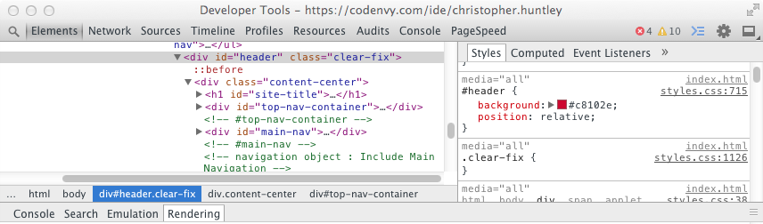
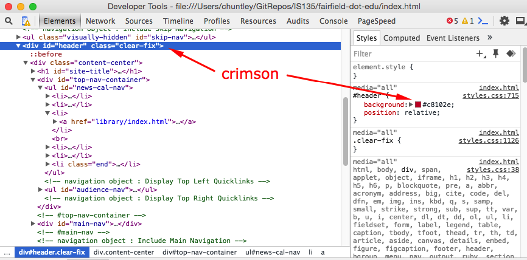
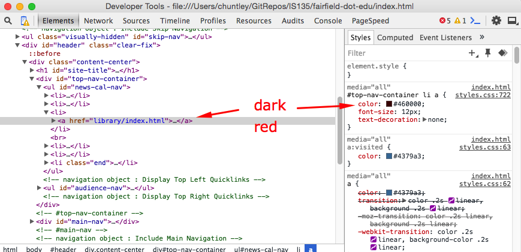
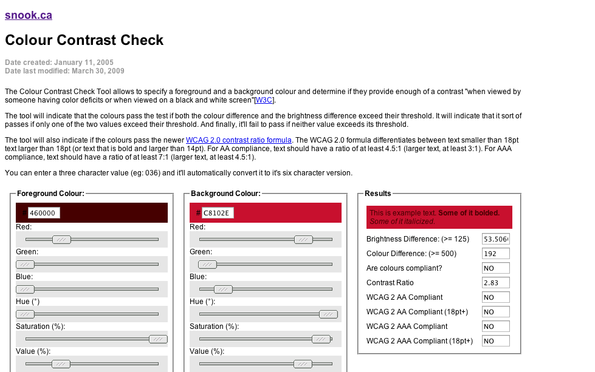
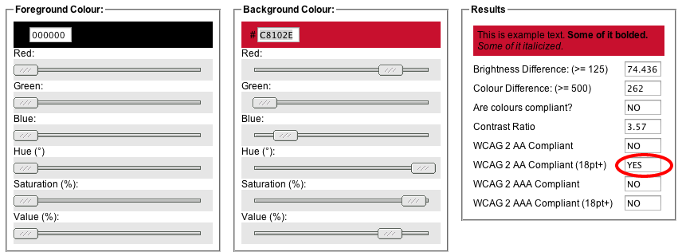
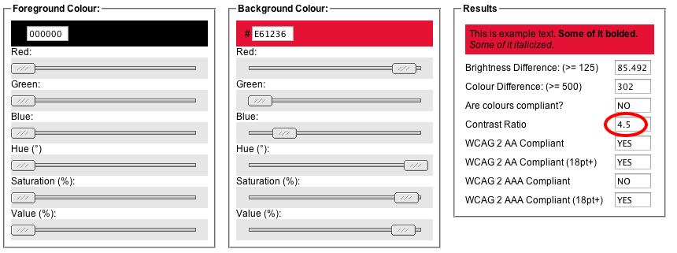
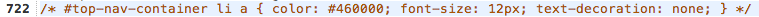
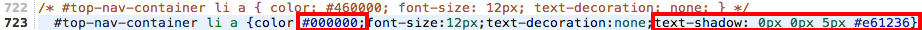

# FairfieldEdu, Part 1: Design for Readability
## Objectives
* Analyze the colors for proper contrast ratios
* Apply CSS to eliminate readability issues without affecting the overall site design

**1. Set up your project folder.**

  * Fork the [fairfield-dot-edu repository](https://github.com/christopherhuntley/fairfield-dot-edu) in GitHub.
  * Clone the repository to GitHub Desktop. As always, take care where you locate the new folder on your drive. It should never be inside another repository folder and it should should be easy to find in Atom.
  > We will be making frequent commits throughout this project so that we have a complete audit trail of every change to the source files and why we are making them. (This level of version control is standard practice for professionals in the field. Not following this practice will get even a good programmer dismissed from a project. It is actually a legal requirement for any system that might be handling financial data.)

  * Open the project in Atom.

**2. Take a peek around the `index.html` file.**
  * In Atom, right-click on the `index.html` file and select "Copy Full Path" from the popup menu. Paste the URL you just copied into Chrome or Firefox to open up the page.
  *  Study the header at the top of the page, which is at best problematic and at worst downright illegal:
    

    >The problem is that the dark red text against a red background is unreadable in anything but a dark room. This problem is made even worse if the user has imperfect eyesight and is struggling to make out the tiny lettering. We can’t enlarge the lettering without impacting the layout, so we will instead see if we can’t do something about the dark-red on red color scheme. In the process, we’ll also make the lettering look slightly bigger without actually changing its size.

  * Right-click on the red background of the header and then choose "Inspect Element" to view the HTML and CSS in the developer tools.
    

    >Make sure you have the `#header` selected in the HTML.  

  * Make a note of the background color, `#c8102e`, which is a bright crimson.
    

  *  Then select the “Library” link in the HTML, where we find that the text color is set to `#460000`, a very dark red.
    

**3. Adjust the colors for readability.**
  * Open up [Jonathon Snook’s Colour Contrast Check](http://www.snook.ca/technical/colour_contrast/colour.html#fg=460000,bg=C8102E) tool to analyze the foreground (`#460000`) and background (`#c8102e`) colors:
  

  >Based on what we see on the right, the current color scheme does not meet the W3C’s WCAG 2 accessibility guidelines at any font size. In order to be compliant for small text like that used in the header we have to get the color contrast ratio to be at least 4.5. It’s currently at only 2.83!

  * Let’s try picking colors that work a bit better. One easy change is to make the text black (`#000000`). That ups the contrast ratio to 3.87, which is halfway to 4.5. The text is still kind of muddy, however.
    

  >Unfortunately, that’s about the best we can do by changing the text color alone. The new black on dark red color scheme would be compliant if we increased to font size to 18pt (about 18px, 50% bigger than the current size), but that would almost certainly break the layout. In order to improve further we will have to choose a lighter shade of red for the background. However, we will want to keep it as close as possible to the original blood red. (School colors matter, right?)

  * In the Color Contrast Check tool slide the knob for the Value (lightness %) to the right, keeping an eye on the contrast ratio. Find the value such that the contrast ratio is exactly 4.5. It won’t be 100% compliant at the AAA level, but it would at least meet the minimal AA standard. Here’s a good setting:
    

  >**Now we have a decision to make. Should we could just arbitrarily lighten the background color of the whole header to `#e61236`? Or do we try using some sort of text-shadow effect to lighten just the few pixels around each character? Let’s try the latter, which seems like the more conservative choice. If successful, then the only thing anybody will notice is that the text is more readable.**

**4. Fix the CSS based on our color contrast analysis.**
  * Open the `styles.css` file for editing.
  * Comment out the current styling for the menu text, which should be somewhere around line 722:
  

  > You may be unfamiliar with the concept of "commenting out" code. A *comment* is a bit of text included in source code that is readable by us humans but ignored by everything else. We use them to make notes to ourselves about what the code does. We also sometime use them to "turn off" code we don't want to be used anymore without actually deleting it. That way if we want to turn it back on again we can just "uncomment" it.

  > In CSS comments are marked by `/*` and `*/`. Anything in between will be ignored by the browser. Atom has built-in support for commenting out code in HTML or CSS. Select line 722 and then choose `Edit`→`Toggle Comments`. Atom will automatically add `/*` to the beginning of the line and `*/` to the end.

  * Copy line 722 and paste it in on the line below. **Uncomment**  the new line (using Toggle Comments again) and then modify the rule as shown:
  

  >The first modification (on the left) sets the text color to black. The second modification (on the right) creates a `5px` blur behind each text character; the effect is that we’re using our new `#e61236` background color just behind the text without affecting the rest of the header background at all.

  * Compare the original (left) with the new version (right):  
  

  >That looks much better, don’t you think? Unless you know what to look for, you’d never notice the color changes at all. If asked to spot the difference, most people will say that the one on the right has a larger font size. Of course, we know the truth.

**5. Save your work.**  
Commit to Git. Use the commit summary “Brought the text color contrast of the #top-nav-container into WCAG 2 compliance.” Push (sync) as usual to GitHub. 
