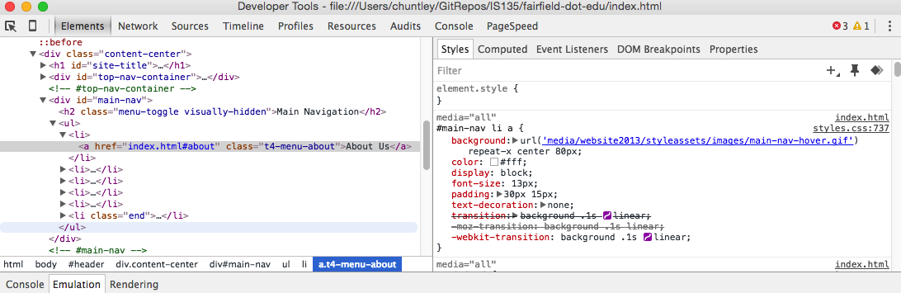
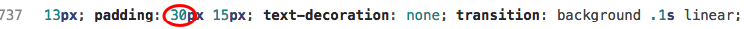
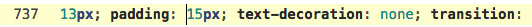
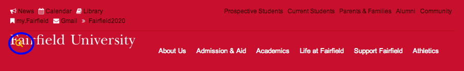
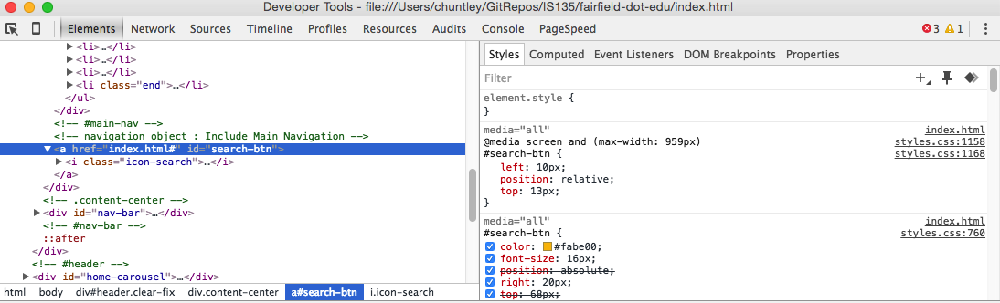
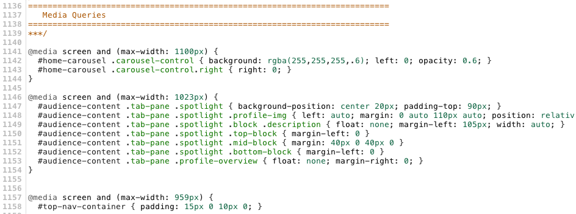
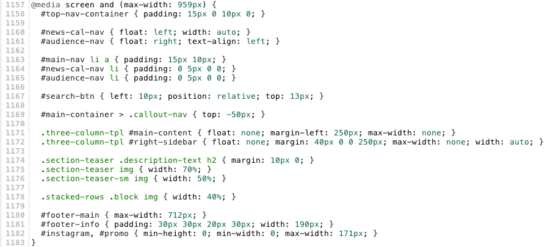
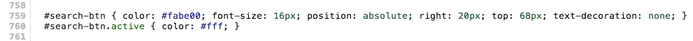
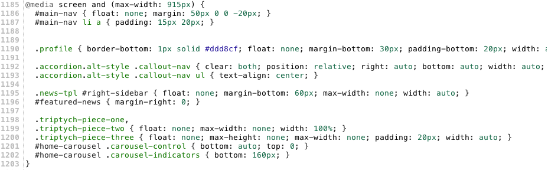
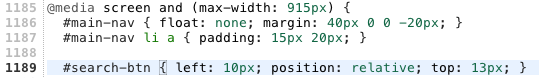

# FairfieldEdu, Part 2: Layout Debugging
## Objectives
* Use Chrome Dev Tools to diagnose layout bugs
* Fix layout bugs by applying knowledge of the box model and positioning

> The bug fixes laid out in the exercise below are 100% real and were present in the live website
throughout the first half of 2014. None are present as of Fall 2015.

> We address the bugs here not to embarrass the professional web designers
that built the site but to show that even the best designers make mistakes and to demonstrate the techniques
used to find and fix the bugs. Web design is a profession and everyone, even the most skilled professional,
needs to always look for ways to improve.

**1. Fix the padding on the `#main-nav` menu items.**

* Open the `index.html` in Chrome at full width. If the search button (magnifying glass) is not at the right place then your browser window is too narrow.


Note how the site navigation menu is misaligned with the Fairfield University wordmark. (Yes, “wordmark” is a real word.) To make it more obvious, the snapshot below shows a median line that should exactly split the links through the middle:


The search icon is aligned properly, but the menu items are not. We need to remove some excess whitespace above and below the links. This will have the added benefit of shrinking the vertical height of the page header, which currently takes up quite of a bit of space “above the fold” within the browser window.

* Right-click on the “About Us” link and inspect it in Chrome Developer Tools ("Dev Tools"). Note the padding on `#main-nav`, which is set to `30px` on top and bottom. Also note the link shown in the upper right of the rule that tells us the location of the rule in the CSS source code.



* Open the `styles.css` file for editing in Atom. **As shown in Dev Tools (see above)**, the error is on line 737:



> If Dev Tools tells you some other line then it's because of your edits to the CSS file in part 1. Go to whatever line Dev Tools indicated. From here on out expect the line numbers given to be slightly off from your copy. You will need to look carefully to be sure you are editing the right CSS rules.

The rule is pretty long and you'll need to scroll over to see the padding declaration.

* Change the padding to 15px all around.



> Again, be sure you are editing the right rule. The selector is `#main-nav li a`.

The alignment is fixed now.


* Repeat the same fix on (about) line 1164, which also selects on `#main-nav li a`. This time, leave the left-right padding at 10px.

```css
#main-nav li a { padding: 15px 10px; }
```

* Commit your work to Git using the summary comment “Fixed the default padding bug in the #main-nav menu items.” Yes, please word it exactly that way. These details are important to any developers who might come after you. Without them they won’t know why you made the changes you did. Remember, your Git commits are actually an audit trail, with all of the implications that implies.

**2. Fix the media queries for the `#top-nav-container`.**

* Resize the browser window to between 915 and 959 pixels. You'll know you're in the right range when you see the gold search icon move to the left, obscuring the Fairfield University wordmark.



Why is this bug only happening between 915 and 959 pixel widths? Dev Tools gives us a clue when we inspect the `#search-btn` element:



Note the use of a media query that handles screens up to 959px wide. Bingo. That's just where we saw the problem.

* Scroll down to line 1136, where we find a series of media queries:



> Do not skim through this next paragraph. Take your time to make sure you understand it thoroughly before continuing on. It covers how cascading works with media queries, which is absolutely critical when designing for the modern web. **If you don’t know what a media query is, please consult your book**.

It looks like the web designers chose a “huge monitor first” strategy (i.e., the opposite of mobile first design), where the default styling (i.e., everything above line 1136 in the `style.css` file) is for large screens. Then the media queries cascade in new rules to handle successively-smaller screens. So, the first media query adds new rules for screens less than 1101 pixels wide that override the default styling for the #home-carousel (with the rotating pictures in it). The other rules above line 1136 are still in play, but the ones in the media query override them. The second media query adds even more overrides for screens smaller than 1024 pixels wide. The third media query kicks in when the screen width is 959px or less. If we scroll down a little further in the stylesheet we see another media query that handles screen widths of 915px and smaller. Notice anything? Recall that the search icon is misplaced between 915 and 959 pixels. Hmmm. The icon position is fine at 915px width but incorrect at 916px width. There must be something fishy about our media queries.

* Let’s dig into the media query that cascades in at 959px width:



What rules in there might affect the positioning of the icon? There is only one rule in the media query that selects the `#search-btn` element:


The default styling for this element is given on (about) line 759:



Notice anything? Compare the default rule to the one in the media query. The media query is switching the positioning from absolute (as set on line 759) to relative and changing the left offset to 15px. Why do that? Wouldn’t it be better to leave it where it is? Comment out the rule in the media query so it no longer has any effect:


> Why comment it out instead of deleting it? So we can reuse it later if needed. It’s an old programmer’s trick. Get used to it.

* Refresh the page again. At 960 pixels wide (i.e., before the media query activates) the alignment looks pretty good:


After resizing the browser to 950 pixels wide, where the media query is active, the icon is in the right place! However, the `#main-nav` links seem to have dropped about 5 pixels. Note how “Athletics” no longer lines up with the search icon:


The problem in this case is actually pretty subtle. It has nothing to do with the navigation menu or the search icon. It’s actually caused by the menu in the upper left corner. Here’s the menu at 960px page width (left) and 959px page width (right):

 

Note how the dark red line below the menu drops a few pixels? Sure enough, here’s the default rule for the menu:


And here’s the rule that kicks in for 959 pixels and narrower:


So, on the large screens the bottom padding was `5px`, but in the media query on line 1158 the bottom padding changes to `10px`. Why? This is probably a bug.

* Change the bottom padding to `5px` inside the media query:


* Save your changes and refresh your browser:


> Make 100% sure your browser is sized at about 950px wide. (You can use the Web Developer Toolbar's `Resize→Display Window Size` to check.) If your copy doesn't look like this, then you need to go back and check your work. You may have edited the wrong lines in the CSS file.

* Commit your work to Git with the summary comment “Fixed the bottom margin bug for the #top-nav-container between 915px and 959px.”

**3. Make the `#main-nav` and `#search-btn` stick together at all widths.**

At about 910 pixels the search button becomes unglued from the navigation links:


The media query that handles 910px starts on about line 1185:



The problem is that the media query moves the `#main-nav` (by removing the float) without also moving the search icon. It seems that the rule we commented out before (on about line 1167) was intended for this media query. Oops. It's a good thing we commented it out instead of deleting it. We can just move it to the right media query.

* Insert the missing rule as shown below:

  

* Confirm that the `#main-nav` and `#search-btn` stay together at all page widths. We could fiddle around with the icon placement some more (by floating `#search-btn` to the right, for example), but that’s good enough for now. It’s hard to say the current placement is a bug, so we won’t fix it.

* Commit your work to Git with the summary comment “Fixed the layout of the #main-nav and #search-btn between 768px and 915px widths.”   


**Push/sync your changes to GitHub. You're done!**
