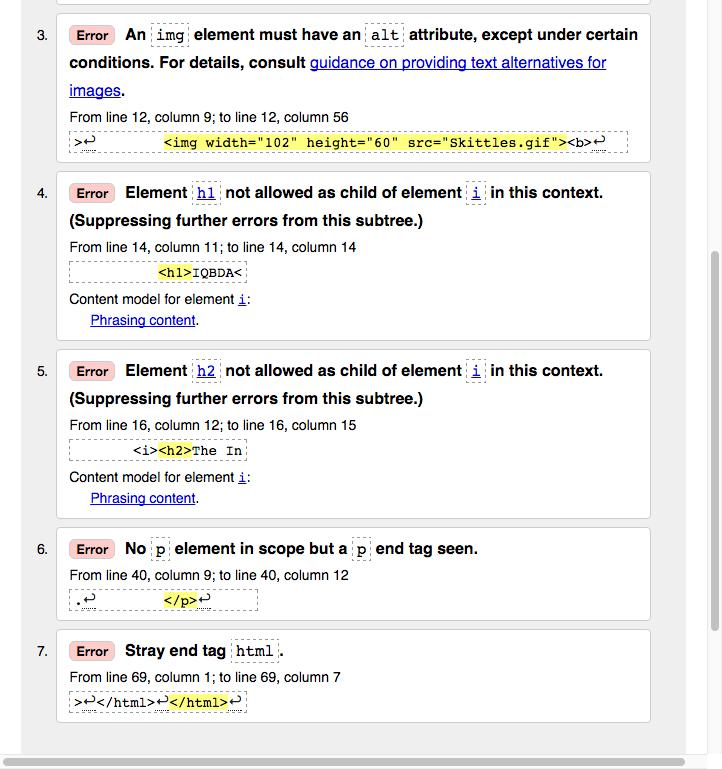
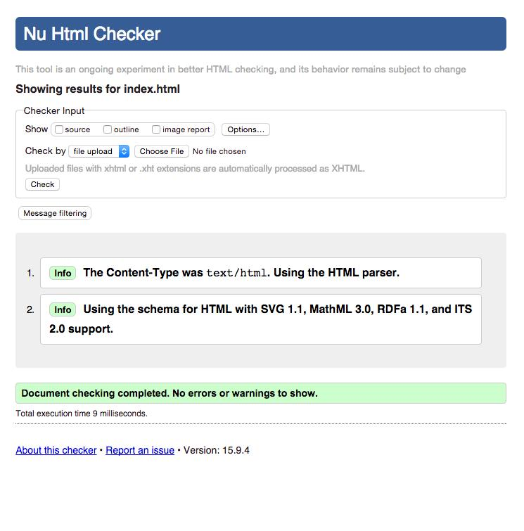
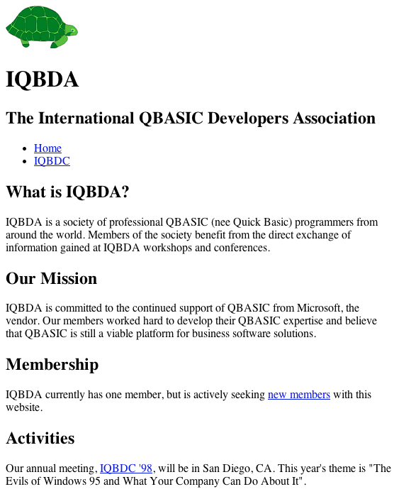

# IQBDA Part 1

## Objectives

**1. Clean up the document structure.**

* Open the IQBDA project in Atom and open the `index.html` file in the editor. In this session we will revise it to make it compliant with HTML5 standards.
* Change the `DOCTYPE` to `html` (i.e., HTML5). Then eliminate all unneeded attributes from the `DOCTYPE`, `html`, and `meta` tags. Make them as concise as possible.
* Use the W3C validator to look for errors. You should get 5 errors (and a couple info messages).

**2. Edit the code to bring the page up-to-date with the HTML5 standard.**

The finished code must follow these guidelines:

* **Sectioning elements are used where semantically appropriate.**
>Replace the header `div` with a `header` element with `id=”masthead"`. Similarly, convert the navbar `div` to a `nav` element with `id=”navbar”` and the 'content' `div` to a `main` element with `class="content"`. If you don’t understand this, please look up `div`, `header`, `nav` and `id` in your book and then ask! The `main` element is a new addition to HTML5 that has only recently gotten 95% support from browsers.

* **The other divs and spans remain unchanged.**
>They are not causing any of our problems, and we’re going to need them later for styling with CSS.

* **No presentational tags are used anywhere.**
>If you don’t know what this means, then please find out. It’s covered in the book and the video. The horizontal rule below the header, for example, is purely cosmetic and should be removed.

* **No element contains anything it’s not allowed to.**
>The second and third validation errors above are caused by failure to follow this rule. The fourth error also has the same cause, but it’s more subtle than the other two.

* **All open container elements are closed.**
>Insert end tags where appropriate.

* **All naked text is wrapped in block elements.**
>Again, "naked text" is covered in the book and the video. If no other tags make sense then just enlose text in paragraphs as needed.

* **All required attributes are specified.**
>Pay attention to the turtle image ('Skittles').

* **The W3C validator returns no errors.**
>Be sure that you have saved the file before running the validator.

  

**3. Check your work.**

The finished page should look a lot like it did at the start, only this time the HTML is valid:

  

**4. Push to GitHub.**

Commit your work to the local Git repository (with the summary comment “Completed part 1”) and then sync your changes to GitHub.
