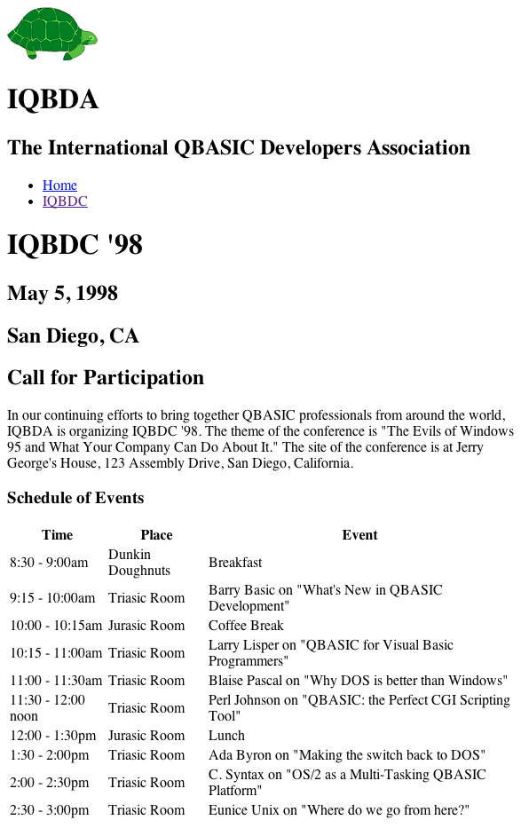

# IQBDA Part 2: Templates and Tables

## Objectives
* Reuse boilerplate HTML for a new document
* Markup text for the web
* Create an HTML table

**1. Study the `index.html` file for reusable 'template' HTML.**  

  * Open the project in Atom. Take a moment to refamiliarize yourself with the `index.html` file. Immediately inside the `body` is a `div` with `id=“page-wrapper”` that acts as a *container* for the entire page. This “page-wrapper” will be used to provide a margin for the page in another work session.

  * Inside the page-wrapper (note: we've stared using this term generically because it's what everybody calls them) are several other sectional and `div` elements that represent various functional regions of the page, as indicated by their `id` attributes: `masthead`, `navbar`, and `content`. Together they act as a template for the page content, one that we’ll want to follow on every page of the site. We will want to reuse the `header` and `nav`, which should look exactly the same on every page, but the `content` will vary. We’ll see how that works in a moment.

**2. Create the `iqbdc.html` file, reusing HTML from `index.html`.**

  * Right-click on the project folder and create a blank file named `iqbdc.html`. Be sure to use all lowercase letters. Otherwise, a couple relative links in index.html won’t match the filename. The file should be completely empty.

  * Copy and paste the entire contents of the `index.html` file into the `iqbdc.html` file. Then close the `index.html` file. For the rest of this exercise we will only be editing the `iqbdc.html` file.

  * Within the `iqbdc.html` file delete the contents of the `content` div to make room for the new content.

  * Open the `iqbdc.txt` file and copy/paste the contents inside the `content` div you just emptied.

**3. Markup the new content with HTML5.**

  Mark up the new content so that:
  * “IQBDC '98” is the page heading; the lines of text immediately under it are subordinate headings. (All belong inside a `header` called `page-header`.)
  * No text is naked.
  * “Schedule of Events” is a heading (but not a caption) for data below it.
  * The schedule data is in a simple `table`.

**4. Review your work.**

  The finished page should look like this:

  

**5. Push to GitHub.**

  Commit your work to the local Git repository (with the summary comment “Completed part 2”) and then sync your changes to GitHub.
