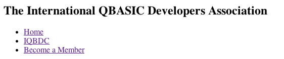
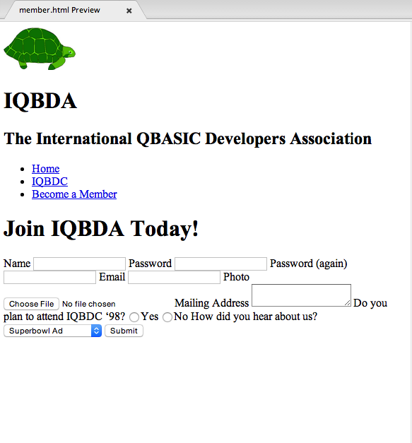
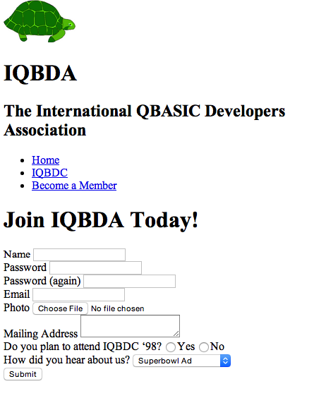
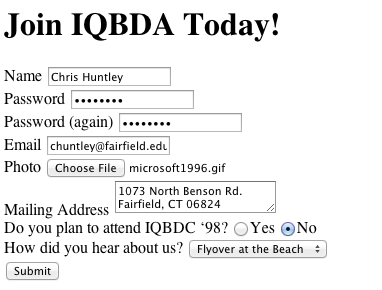
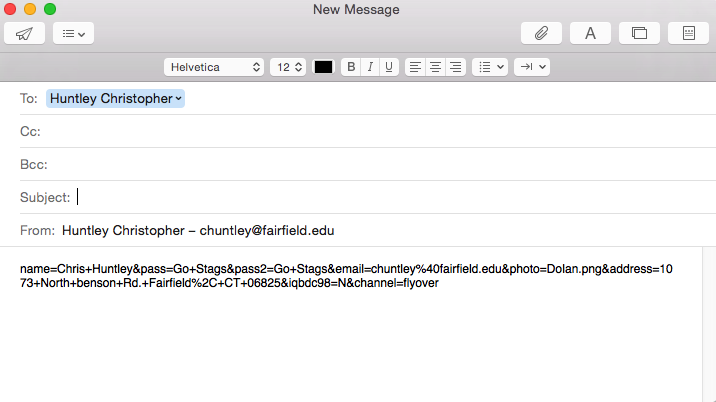

# IQBDA Part 3: HTML Forms

## Objectives
* Create a basic form from scratch
* Learn about form elements and labels
* learn about URL data encoding

**1. Add the new `member.html` page.**
  * Create a blank `member.html` file.
  * Add a navigation link for the `member.html` file to the navbar menus in the `iqbdc.html` and`index.html` files. The link text should be “Become a Member”.
    
  * Near the bottom of the `index.html` file there is a link in the content that has is supposed to refer to the `member.html` file. Update the link to point to the new file and take out the `onclick` attribute that has the javascript popup message.
  * Use the ‘template’ for the member.html file. Follow the same technique we used in Part 2  to reuse the `index.html` code for everything except the main page content.
  * Give the `member.html` a `header` with the headline “Join IQBDA Today!”. (Look at how we did that in Part 2. Be consistent!)
  * Close the `index.html` and `iqbdc.html` files. The rest of this exercise will focus just on the new `member.html` file.

**2. Create the required form elements.**
  * Create a `form` element that submits results as a post to *your email address*.
    >If you don’t know how to create email URLs or how to specify `post` instead of `get`, then please refer to your book! It’s both a textbook and a reference.
  * Add the following fields to the form:

| Field Name | Label | Control Type | Options |
|------------|-------|--------------|-------- |
| name | Name | text | |
| pass | Password | password | |
| pass2 | Password (again) | password | |
| email | Email | email| |
| photo | Photo | file | |
| address | Mailing Address | textarea| |
| iqbdc98 | Do you plan to attend IQBDC ‘98? | radio | “Y”,”N” |
| channel | How did you hear about us? | select | "Superbowl Ad", "News Article", "Email", "Flyover at the beach" |

  A few tips:
  * Each field should have a `label` element. Whenever possible use explicit labeling, where the `for` attribute of the `label` element matches the `id` attribute of the input.
  * Labels for `radio` controls are handled a little differently from the rest. Each option (“Yes” or “No”) should have its own `label` (attached explicitly). In addition, the question “How did you …” is also a `label`, but don’t attach it to anything; just use a `label` element without a `for` attribute. If you try to use implicit labeling as described in the book you will actually get a bug.
  * Don’t forget to add a submit button to the bottom of the form.

**3. Do a little temporary formatting.**
* Preview your page. The form should look like this:
  
  Notice how all the fields show up on one line? That’s because form inputs are inline elements. We can change that with CSS, but for now just add a ` ` to the end of each field.  
* Preview again. After adding the line breaks the page should look like this:
  
  It's not pretty, but at least it isn't a jumble of fields.

**4. Test and debug your form.**
  * Open your file in a web browser. You can get the URL of the file by right-clicking on it in the right-hand panel in Atom and selecting "copy full path".
  > Why test the page in a web browser instead of the Atom previewer? Because you always want to test your pages in the same software your users will be using. In this case that's a web browser.

  * Click on each of your labels. When you click on a label, the focus (i.e., the cursor) should jump to the corresponding input element. If it doesn't then there is a bug.

  You’ve got three possible bugs to look for. The first is that the `for` and `id` attributes don’t match when using explicit labeling. The second is that you closed the `label` too soon when using implicit labeling (which you shouldn’t be using anyway). The last possibility is that you didn’t use a `label` for each radio button.

  * Enter some data in your form and submit it.
    

    *If you set up your default email client on your computer* then submitting the form will open up a new email with a string of characters inside. This is a *query string* like the ones described by the book. That's actually the message that the webserver would have received if we had set the form `action` to a web URL instead of an email URL.

    

**5. Finish up.**
Commit and Sync your changes to GitHub. use the commit summary 'Part 3 complete'.
