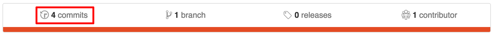
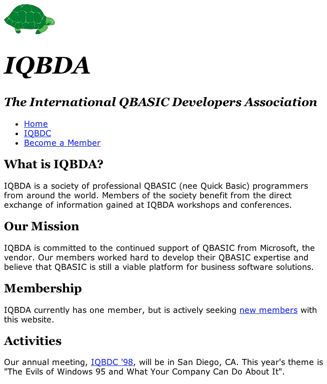
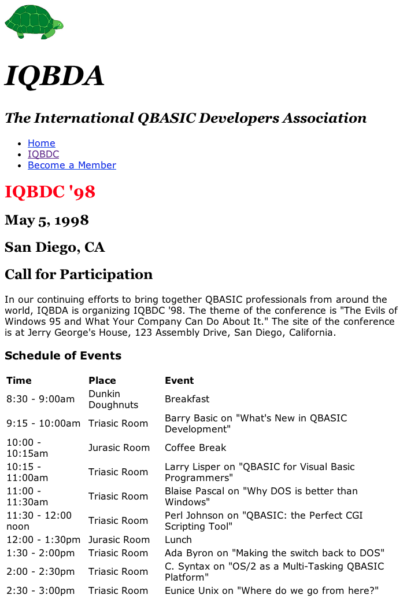

# IQBDA Part 4: Basic Styling with CSS

## Objectives
* Use Git's version history to detect differences
* Link to an external stylesheet
* Create an embedded stylesheet
* Use cascading to override default text styles

**1. Make sure your GitHub is up to date.**  
Look for any uncommitted changes in GitHub Desktop. If you find any, then commit and push whatever you've currently got to GitHub.

**2. Refresh your HTML.**  
Make sure your HTML matches the following exactly.
In fact, why not copy and paste to be sure?

**index.html**
```html
<!DOCTYPE html>
<html>
  <head>
    <meta charset="utf-8">
    <title>IQBDA</title>
    <link rel="stylesheet" type="text/css" href="base.css" media="screen" />
  </head>
  <body>
    <div id="page-wrapper">
      <header id="page-header">
        
        <h1>IQBDA</h1>
        <h2>The International QBASIC Developers Association</h2>
      </header>

      <nav id="navbar">
        <ul>
          <li>
            <a href="index.html">Home</a>
          </li>
          <li>
            <a href="iqbdc.html">IQBDC</a>
          </li>
          <li>
            <a href="member.html">Become a Member</a>
          </li>
        </ul>
      </nav>
      <div id="content">
        <h2>What is IQBDA?</h2>
        <p>
          IQBDA is a society of professional QBASIC (nee
          Quick Basic) programmers from around the world.
          Members of the society benefit from the direct
          exchange of information gained at IQBDA workshops
          and conferences.
        </p>
        <h2>Our Mission</h2>

        <p>
          IQBDA is committed to the continued support of
          QBASIC from Microsoft, the vendor. Our members
          worked hard to develop their QBASIC expertise and
          believe that QBASIC is still a viable platform for
          business software solutions.
        </p>
        <h2>Membership</h2>
        <p>
          IQBDA currently has one member, but is actively
          seeking <a href="member.html">new members</a>
          with
          this website.
        </p>

        <h2>Activities</h2>
        <p>
          Our annual meeting, <a href="iqbdc.html">IQBDC
          '98</a>, will be in San Diego, CA. This
          year's theme is "The Evils of Windows 95 and
          What Your Company Can Do About It".
        </p>
      </div>
    </div>
  </body>
</html>
```

**iqbdc.html**
```html
<!DOCTYPE html>
<html>
  <head>
    <meta charset="utf-8">
    <title>IQBDA</title>
    <link rel="stylesheet" type="text/css" href="base.css" media="screen" />
  </head>
  <body>
    <div id="page-wrapper">
      <header id="page-header">
        
        <h1>IQBDA</h1>
        <h2>The International QBASIC Developers Association</h2>
      </header>

      <nav id="navbar">
        <ul>
          <li>
            <a href="index.html">Home</a>
          </li>
          <li>
            <a href="iqbdc.html">IQBDC</a>
          </li>
          <li>
            <a href="member.html">Become a Member</a>
          </li>
        </ul>
      </nav>
      <div id="content">
        <header id="page-title">
          <h1>IQBDC '98</h1>
          <h2>May 5, 1998</h2>
          <h2>San Diego, CA</h2>
          <h2>Call for Participation</h2>
        </header>

        <p>In our continuing efforts to bring together QBASIC professionals from around the world, IQBDA is organizing IQBDC '98. The theme of the conference is "The Evils of Windows 95 and What Your Company Can Do About It." The site of the conference is at Jerry George's House, 123 Assembly Drive, San Diego, California.</p>
        <h3>Schedule of Events</h3>
        <table>
          <tr><th>Time</th><th>Place</th><th>Event</th></tr>
          <tr><td>8:30 - 9:00am</td><td>Dunkin Doughnuts</td><td>Breakfast</td></tr>
          <tr><td>9:15 - 10:00am</td><td>Triasic Room</td><td>Barry Basic on "What's New in QBASIC Development"</td></tr>
          <tr><td>10:00 - 10:15am</td><td>Jurasic Room</td><td>Coffee Break</td></tr>
          <tr><td>10:15 - 11:00am</td><td>Triasic Room</td><td>Larry Lisper on "QBASIC for Visual Basic Programmers"</td></tr>
          <tr><td>11:00 - 11:30am</td><td>Triasic Room</td><td> Blaise Pascal on "Why DOS is better than Windows"</td></tr>
          <tr><td>11:30 - 12:00 noon</td><td>Triasic Room</td><td> Perl Johnson on "QBASIC: the Perfect CGI Scripting Tool"</td></tr>
          <tr><td>12:00 - 1:30pm</td><td>Jurasic Room</td><td>Lunch</td></tr>
          <tr><td>1:30 - 2:00pm</td><td>Triasic Room</td><td>Ada Byron on "Making the switch back to DOS"</td></tr>
          <tr><td>2:00 - 2:30pm</td><td>Triasic Room</td><td>C. Syntax on "OS/2 as a Multi-Tasking QBASIC Platform"</td></tr>
          <tr><td>2:30 - 3:00pm</td><td>Triasic Room</td><td>Eunice Unix on "Where do we go from here?"</td></tr>
        </table>
      </div>
    </div>
  </body>
</html>
```
**member.html**
```html
<!DOCTYPE html>
<html>
  <head>
    <meta charset="utf-8">
    <title>IQBDA</title>
    <link rel="stylesheet" type="text/css" href="base.css" media="screen" />
  </head>
  <body>
    <div id="page-wrapper">
      <header id="page-header">
        
        <h1>IQBDA</h1>
        <h2>The International QBASIC Developers Association</h2>
      </header>

      <nav id="navbar">
        <ul>
          <li>
            <a href="index.html">Home</a>
          </li>
          <li>
            <a href="iqbdc.html">IQBDC</a>
          </li>
          <li>
            <a href="member.html">Become a Member</a>
          </li>
        </ul>
      </nav>
      <div id="content">
        <header id="page-title"><h1>Join IQBDA Today!</h1></header>
        <form action="http://is-dsb.fairfield.edu/is135/iqbda-signup.php" method="post">
          <label for="name-field">Name</label>
          <input id="name-field" type="text" name="name">

          <label for="pass-field">Password</label>
          <input id="pass-field" type="password" name="pass">

          <label for="pass2-field">Password (again)</label>
          <input id="pass2-field" type="password" name="pass2">

          <label for="email-field">Email</label>
          <input id="email-field"type="email" name="email">

          <label for="photo-field">Photo</label>
          <input id="photo-field" type="file" name="photo">

          <label for="address-field">Mailing Address</label>
          <textarea id="address-field" name="address"></textarea>

          <label>Do you plan to attend IQBDC ‘98?</label>
          <input type="radio" name="iqbdc98" value="Y" id="iqbdc98-Y"><label for="iqbdc98-Y">Yes</label>
          <input type="radio" name="iqbdc98" value="N" id="iqbdc98-N"><label for="iqbdc98-N">No</label>

          <label for="channel-field">How did you hear about us?</label>
          <select id="channel-field" name="channel">
            <option value="superbowl">Superbowl Ad</option>
            <option value="news">News Article</option>
            <option value="email">Email</option>
            <option value="flyover">Flyover at the Beach</option>
          </select>
          <input type="submit">
        </form>
      </div>
    </div>
  </body>
</html>
```
**3. Commit, push, and review changes.**
  * Commit your changes using the summary comment "Refreshed HTML in part 4."  
    >Don't have any changes? Then make sure you saved your files in Atom. You may also be lucky enough to have typed in your code exactly like the solution, but that's very unlikely.
    
  * Push to GitHub.
  * Open your GitHub IQBDA repo in your browser. Click on the "commits" link at the top of the page.

    

  > You will see a list of commits in reverse chronological order, with the most recent at the top.

  * Click the most recent commit. GitHub will display a "diff" (for difference) between the commit and the version before it. The lines in red were removed, while the lines in green were added. An edit to an existing line is displayed as adding the line (with the edited text) followed by a removing a line (with the old text).
    >Note what changed in each file. Those are places where you may have missed something when you were doing the assignment yourself. Now we can safely continue on with CSS knowing that we are using the same HTML code.

**4. Use CSS to override the default styling.**  

  Create a new CSS file called `base.css`. This is where we’re going to put all our basic styling for the site.
    > The HTML refresh from step 2 included the `link` needed to load the `base.css` external stylesheet.

  Add style rules to the `base.css` file that meet the following specifications, which we'll pretend come from an art director with no web design experience:  

  * **Masthead Text:** Georgia/Times/serif and italics, with the “IQBDA” in 3em bold type and the "The International ..." in 1.5em semi-bold type  
  * **Page Title Text:** Georgia/Times/serif in 1.8em bold type  
  * **Sub-heading Text:** Georgia/Times/serif in 1.5em semi bold type  
  * **All other text:** Verdana/Helvetica/Arial/sans serif in 1em regular weight type  

Tips:
  * You will need to use **descendant selectors** to get the headline text to work.
  * Semibold is `bolder` than normal text but not fully `bold`; try using the `font` shortcut property to cut down on the number of declarations.
  * If you don’t know how to do something, just ask! If somebody needs help, then provide whatever help you can. This is not a game, so there is no reason not to help your classmates understand how to do things.
  * Some things just can't be done with CSS. Know when to give up and ask for direction given what you can do.

When you're finished the preview should look this:

  

**5. Add special styling to `iqbdc.html`.**
* Add a `style` element to the `head` of the `iqbdc.html` file.
  > You will need to refer to your textbook to see how to do that properly. It's an embedded stylesheet.

* Add two rule to the new `style` element, one to left-align the column headers of the table and then another rule that changes the `color` of any `h1` elements inside `#page-title` to `red`.
  >**Important: do not copy any style rules from your `base.css` file. The idea is to let the embedded stylesheet override the styles in `base.css` through cascading. You are only adding *two* rules.**  

* When finished you should see the following in your `iqbdc.html` preview:

  


**6. Save your work.**  
Commit and sync your changes to GitHub. Use the commit summary 'Part 4 complete'.
