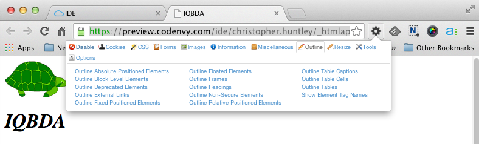
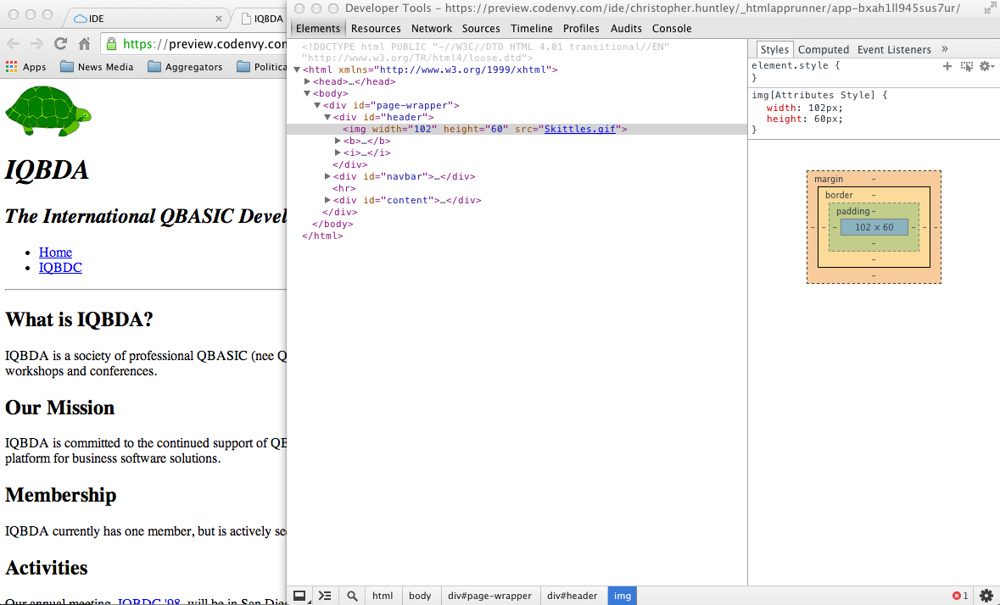

# IQBDA Preliminaries: GitHub and Atom

The goal of this exercise is to get more experience using GitHub and Atom. We will start doing actual work on the files in Part 1.

1. Fork and clone the [IQBDA project from GitHub](https://github.com/christopherhuntley/iqbda). Be sure to fork before cloning and to clone *your* fork of the project repository. Otherwise you will get authorization errors when you try to push your work back to GitHub. Also take care to clone the project to an appropriate folder on your local drive. You need to be able to find it later.  
2. Open the new project folder in Atom. On a Mac, you should be able to open it from GitHub Desktop. On Windows you may have to search through folders to find it.
3. Inside are four files: `Readme.md`, `index.html`, `Skittles.gif`, and `iqbdc.txt`. Double-click the `index.html` file to open it in the editor panel. As the name suggests, it is an HTML file with tags and content inside. *It's actually a pretty bad HTML document written in an archaic version of HTML in 1998. We'll spend the rest of the tutorial cleaning it up.*
4. Select `Packages`→`Preview HTML`→`Enable Preview` to see what the HTML page looks like. 
5. Open the `index.html` file in Chrome or Firefox. (Again, this is much easier if you always keep your Git repos in athe same place.) The page should pretty much the same as in the HTML Preview panel in Atom.
6. Locate the Web Developer Toolbar that we installed in the [Setup](../Setup.md) assignment. 
7. Select the `Outline` tab/link and then click on `Outline Headings`. Colored rectangles will appear on the page to highlight section headings. It's like having an X-ray to see the structure of the page. Click on `Outline Headers` again to toggle off the highlighting.
8. Use the W3C HTML Validator to give the file the sniff test. (You'll need to use the `File Upload` method and upload the `index.html` file.) As you can see, there are plenty of errors, even on this short page! We’ll have to fix them all, but we’ll leave that for later.
9. Now let’s try out another useful tool. Chrome’s Developer Tools (not to be confused with the Web Developer Toolbar) provides a source-oriented toolkit for studying your pages. To see the part of the HTML that displays the turtle (a.k.a., Skittles), right-click on the turtle image and select `Inspect Element`. The HTML will open up in a Developer Tools window/pane. (Firefox provides a very similar tool, including the ability to right-click to 'inspect' the HTML for a given HTML element.)

10. Once opened, you can use Developer Tools to explore the rest of the HTML as needed. To reveal more of the HTML, just click on the little triangles displayed with the HTML in the Developer Tools Elements tab. The triangles are used to “fold” and “unfold” the HTML. If you click on the triangle next to the `<b>` tag just below the `` tag, Developer Tools will unfold the element to show its contents. Click the triangle next to the `<i>` tag and it will show the IQBDA header just below the turtle image. To help you match up the HTML with the page, the Developer Toolbar will highlight the portion of the page that corresponds to whatever HTML is currently under the mouse cursor. For example, if you hover your mouse cursor over `<h1>IQBDA</h1>` in the Developer Tools window, part of the page will be highlighted in blue and tan. The blue represents the content area of the header (i.e., where text is displayed), while the tan represents margin (white space) around the header text. (Tip: A legend of sorts for the highlighting colors is on the right in the screenshot above.)
11. We're done for now. Close your IQBDA window in Atom. You can also quit out of Atom and GitHub Desktop.  
