# Part 1: Make Netscape Validate.

## Objectives
* Creating a website from source
* Starting a Git repository from scratch
* More practice with GitHub and Atom
* Validating and debugging HTML source code
* Learning a bit of Web History

**1. Project Setup.**

* In GitHub Desktop create a new local Git repository by clicking the plus sign in the upper-left-hand corner, selecting Create, and entering the name `nutscape-and-exploder`. This is where we will be keeping your local copy of the project.

  

* You'll see your new repository on the **Other** list below those on **GitHub**. GitHub Desktop makes the distinction is because we can use GitHub Desktop with **Bitbucket**, **GitLab**, or any number of other Git hosting systems to share our repositories on the web. Currently the repository isn't hosted -- it's just a folder on your local hard drive -- so it's listed as **Other**.

  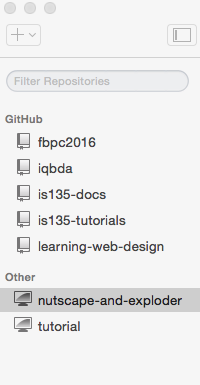

* Press the `Publish` button to setup the repository at GitHub.

 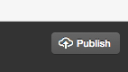

* In the publish dialog (popup form), give the repository a useful description and then push it to GitHub.

  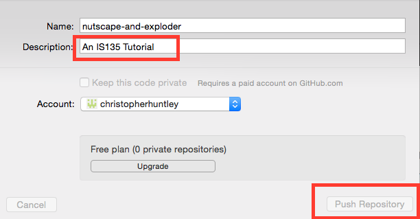

 The repository should now move from **Other** to **GitHub** in the repo lists in GitHub Desktop. You will also find an empty repository on your GitHub account. That's okay.

**2. Create and commit a working copy of the source code.**

* Using Chrome or Firefox, search for a web page with the text "Welcome to Netscape" from Mosaic Communications. The page should look something like this:

  

  This page was part of one of the first commercial websites and home to the makers of the Netscape Navigator browser. There was more to the site, of course. Just point your browser to http://home.mcom.com to see the rest. The company, which eventually became Netscape Communications, was sold to AOL back in the late 1990s. AOL continues to host the site because of its historical value. If you go to http://mcom.com you will be redirected to a copy of AOL's home page.
* Select`view source` from the Web Developer Toolbar. In Chrome that's in the toolbar's `Tools` menu. In Firefox it should be visible on the right of the toolbar.

  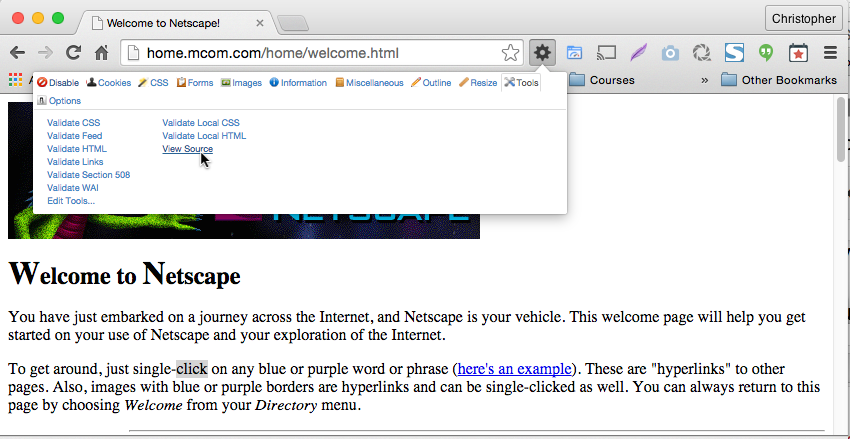

  The source code should look like this:

  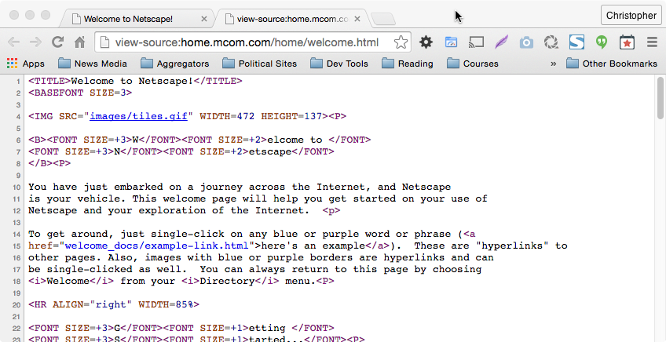

* We'll want to make a copy of the HTML source, but first we need to create a place to put it in our project folder. Go back to Atom, with the `nutscape-and-exploder` project open. Right-click on the folder and select `New file`; name the file `welcome1994.html`.

* Back in Chrome/Firefox, select and copy the HTML source, all the way from the top of the page to the bottom.
  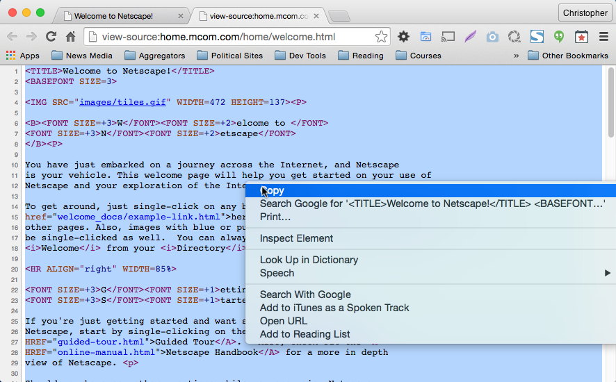

* In Atom, paste the HTML into the `welcome1994.html` file.
  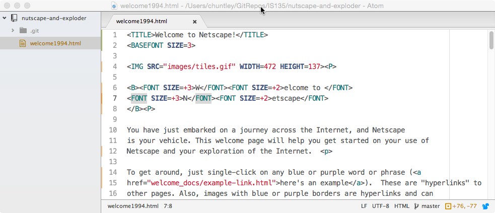

  Save the file and then Preview the HTML (`Packages`→`Preview HTML`→`Enable Preview`). You should see the text, but the banner image at the top is missing. The image we need is still there on the Netscape page. We just haven't copied it yet.
  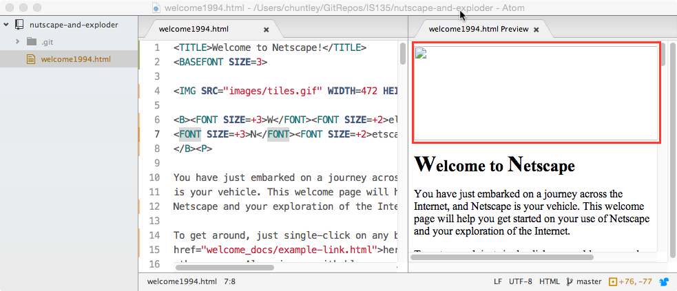
* Go back to your web browser and close the HTML source tab. Then right-click on the banner image at the top, select "Save image as ...", and save it to your `nutscape-and-explorer` folder. Great, we're almost all set up! However, if we preview the HTML in Atom, we still don't see the banner image.
  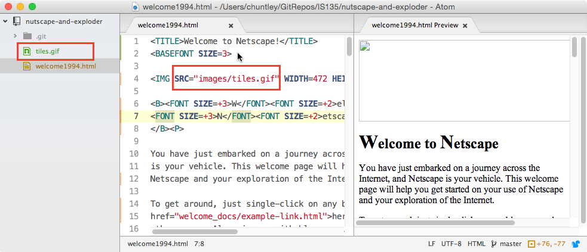

  The file is definitely there -- we can see it on the left -- but it is simply not shown in the preview. The solution is in the `src` of the image in the html. Notice how the filepath starts with `images/` before it gets to the `tiles.gif` filename? That means that the file is supposed to be inside a folder called `images`. So, create a new folder named `images` (right-click on the project at left and select `New Folder`), click on the folder to expand it, and then drag the `tiles.gif` file into the new folder. After closing and reopening the HTML preview, you should finally see the missing banner image. The new folder with the file nested inside is shown at left.

  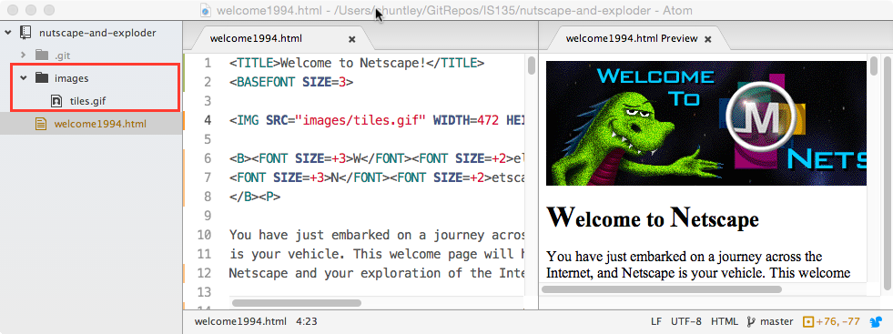

* Right-click on the `welcome1994.html` file and make a `Duplicate`. Name the duplicate `welcome2015.html`. We are going to be doing all our work on the `welcome2015.html` file, comparing it from time to time to the original `welecome1994.html` to mark our progress.

* In GitHub Desktop, commit your changes (three files) with the summary comment 'Initial file import'. Then publish (push) your changes to GitHub.

**3. Validate the `welcome2015.html` file.**

* Use the W3C HTML Validator to validate the file. You should use the 'Validate by File Upload' method and then select the file from your hard drive. Before hitting the 'validate' button, expand the 'More Options' menu and then set the 'Document Type' to 'HTML5 (experimental)'. You should get a total of 47 errors, warnings, and info messages.

  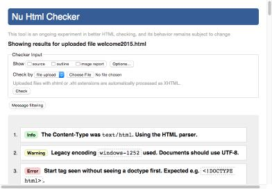

  *If your results don't look like this then you likely did not select HTML5 as the 'Document Type'.*

* Your job this session is to revise the `welcome2015.html` file to comply with HTML5, even if it doesn't come out looking exactly the same in the browser. We’ll step through each bugfix together in the steps that follow. First, however, take a couple minutes to talk through some of the errors:

  - A missing DOCTYPE (error message #3), which is why we had to set HTML5 in the validator.
  - An `img` tag missing an `alt` attribute. the vaidator will flag this for every image that doesn't have alt text for accessibility. If you have a purely decorative image that does not need explanatory text, then the right thing is to set the alt text to an empty text string ('').
  - Use of obsolete tags, including `basefont` (in error #6), `font` (many times), and `center` (error #44). This should be expected. We use CSS to handle things like fonts and centering in HTML5.
  - Other obsolete attributes like `align` and `width` being used on some `hr` tags. Like the bad tags, these properties are also invalid because they are handles by CSS now.
  - Several messages like `Element hr not allowed as child of element h2 in this context.` This particular message means that the `hr` tag is being used improperly. We'll see why in a bit.


**4. Fix some of the basic structural errors.**

* Take a good long look at the HTML code. We're missing some things. We don't even have an `HTML` tag! Remember that this page from 1994 predates standard HTML; lots of tags we use today didn't exist yet.
* Add the necessary HTML document structure. It needs the `HTML`, `HEAD`, and `BODY`. Add the required markup, remembering to place the `TITLE` element inside the `HEAD`. It also needs a proper HTML5 `DOCTYPE` at the top of the file. *You may need to go back to your book to be sure you have used the right tags in the right places.*

  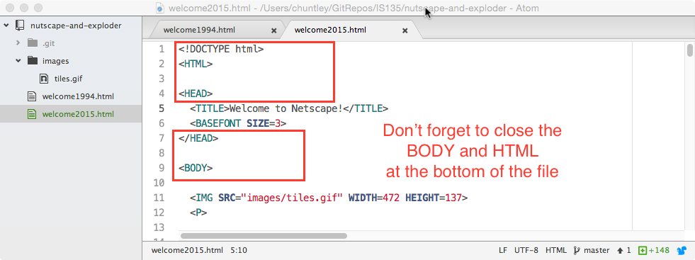


**5. Eliminate Obsolete HTML Markup.**

Eliminate all the obsolete tags and attributes that were used to do things that CSS is supposed to handle now. That includes:
* all `FONT`, `CENTER`, `BASEFONT` tags
* all `ALIGN`, `WIDTH`, and `SIZE` attributes from the `HR` tags
* Bold (`B`) tags used for things that are really headings

When deleting the tags take care not to also delete any text content. We’ll need that.


**6. Fix the headings.**

Give some meaning to the headings. Wrap an `H1` element around the “Welcome to Netscape” text. Then wrap `H2` elements around “Getting Started,” “Exploring the Internet,” etc. until you get to the end of the file.


**7. Check your progress.**

  Run the W3C Validator again. You should get 13 messages, many of which read `Element hr not allowed as child of element h2 in this context.` That's better, but we're obviously not done.


**8. Address the obvious validation errors.**

* Add a `META` element to the HEAD with the `UTF-8` character set. You may want to look up the syntax for the `META` tag in your book to be sure you’re doing it right. Rerun the validator to make sure the charset error goes away.
* Add an `ALT` attribute to the `IMG` tag indicating that the image is a 'logo'. Rerun the validator again. While you’re there, wrap some quotation marks around the numerical height and width attributes. While HTML5 allows numerical attribute values to be unquoted, it’s considered unprofessional and besides, the next version of HTML may require the quotes.


**9. Debug the extra `</UL>` flagged by the Validator.**

  The stray `</UL>` is an artifact left behind from a previous version of the page. Apparently, the definition list (`DL`) element in the middle of the page was originally a bullet list (UL). Change the `</UL>` to `</DL>`. Make sure you’re doing it in the right place. That’s why the validator gives you a line number. Rerun the validator; two list-related bugs (stray `</UL>` and unclosed `<DL>`) should go away. In fact, the validator may even say the page passes! Of course that doesn’t mean we’re done. There are still lots of problems to fix.


**10. Make sure all the list elements are closed properly.**

  There are apparently lots of missing end tags (i.e., with `/` in them). In the early days of HTML a lot of end tags were optional, especially in lists. Let’s start with the end tags in the `DL` and `UL` elements. That means inserting `</li>`, `</dt>`,`</dd>` and possibly some `</ul>` and `</dl>` tags to close things properly.

  Go to the end of the first `DT` element within the definition list:

  ```html
  <DT>
  <A HREF="welcome.html">Welcome</A>
  <DD> That's this page -- your initial home page.
  <P>
  ```

   There are multiple problems here. First, there needs to be a `</DT>` at the end of the second line to close off the `<DT>` on the first line. Second, there needs to be a `</DD>` at the end of the third line to close out the `<DD>`. Finally, on the last line there is an 'extra' `P` tag,  which is how Netscape proposed to mark paragraph breaks (i.e., `<P>` would show up at the end of each paragraph instead of having `<P>` at the beginning and `</P>` at the end), list items, etc. Remove the spurious `P` tag. Repeat this process for each `DT` and `DD` element in the `DL`. Don’t forget to cut out the spurious `P` tags.

   Then follow the same basic process for the unordered list farther down the page. You’ll need to replace a bunch of `<P>` tags with `</LI>` tags.


**11. Fix any misplaced/missing P tags.**

Given how Netscape had a penchant for adding extra `<P>` tags at the end of things, we still have a bunch of them littering our document.

* Check each block of text that looks like a paragraph. Does it have a `<P>` in front and a `</P>` behind? If not, then fix it. You shoudl end up with exactly 5 `P` elements.
* Validate your HTML again. You should get no more errors about `P` elements *except* you might get one error about an unmatched `</P>` just after the `</DL>`. It seems that it is illegal to nest a `DL` inside a `P`. To fix it just move the `</P>` up the file to just above the `<DL>` that starts the definition list. Validate again. You should get no more `P` errors.


**12. Fix the `Element hr not allowed as child of element h2 in this context` errors.**

This error is caused by nesting the series of `HR` (horizontal rule) tags inside an `H2` element near the bottom of the file.

* Move the misplaced `<H2>` tag to just below the `HR` elements and just before the text 'Welcome to the world of Netscape'.
* Validate one last time. You should get zero errors.

  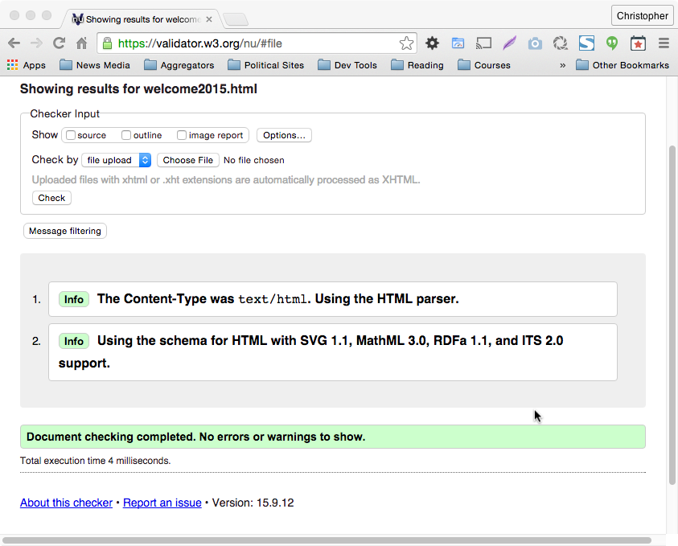


**13. Check (and correct) your work.**

Here is a finished copy that validates:

```html
<!DOCTYPE html>
<HTML>

<HEAD>
  <TITLE>Welcome to Netscape!</TITLE>
  <META CHARSET="UTF-8">
</HEAD>

<BODY>

  

  <H1>Welcome to Netscape</H1>

  <P>
    You have just embarked on a journey across the Internet, and Netscape is your vehicle. This welcome
    page will help you get started on your use of Netscape and your exploration of the Internet.
  </P>
  <P>
    To get around, just single-click on any blue or purple word or phrase
    (<a href="welcome_docs/example-link.html">here's an example</a>).
    These are "hyperlinks" to other pages. Also, images with blue or purple borders are
    hyperlinks and can be single-clicked as well. You can always return to this page by choosing
    <i>Welcome</i> from your <i>Directory</i> menu.
  </P>

  <HR>

  <H2>Getting Started...</H2>
  <P>
    If you're just getting started and want some help on how to use Netscape, start by
    single-clicking on the following hyperlink: <A HREF="guided-tour.html">Guided Tour</A>.
    Also, check out the <A HREF="online-manual.html">Netscape Handbook</A> for a more
    in depth view of Netscape.
  </P>
  <P>
    Should you have any other questions while you are using Netscape, please check out our
    <A HREF="faq.html">Frequently Asked Questions</A> page.
  </P>

  <HR>

  <H2>Exploring the Internet</H2>
  <P>
    If you are ready to get on with exploring, you'll find some good Internet starting
    points under the <I>Directory</I> menu. They are:
  </P>
  <DL>
      <DT>
        <A HREF="welcome.html">Welcome</A> </DT>
      <DD> That's this page -- your initial home page. </DD>

      <DT>
        <A HREF="whats-new.html">What's New!</A>
      </DT>
      <DD>Want to discover the newest interesting places and events on the Internet?
      The net is growing every day, and the What's New page will provide you with links
      to the newest pages and services that you can visit.</DD>

      <DT>
        <A HREF="whats-cool.html">What's Cool!</A>
      </DT>
      <DD>Tired of slogging through the What's New page looking at every new Internet
      site under the sun? The What's Cool page highlights some of the most interesting
      and compelling resources on the Internet. It changes regularly, so stop back often.
      </DD>

      <DT>
        <A HREF="newsrc:">Go to Newsgroups</A>
      </DT>
      <DD>There are thousands of newsgroups on the Internet where users get together to
      discuss a wide variety of topics. With Netscape, you can participate in these groups,
      follow along and get involved in conversations, and post your own replies.</DD>

      <DT>
        <A HREF="internet-index.html">Internet Directory</A>
      </DT>
      <DD>This is your Directory of Directories: each of these directories is a catalog of
      available information on the Internet.</DD>


      <DT>
        <A HREF="internet-search.html">Internet Search</A>
      </DT>
      <DD>This page will help you search the Internet for specific information and services.</DD>


      <DT>
        <A HREF="internet-white-pages.html">Internet White Pages.</A>
      </DT>
      <DD>If you're trying to contact someone else who is on the Internet, try this page.</DD>


      <DT>
        <A HREF="about-the-internet.html">About the Internet?</A>
      </DT>
      <DD>Want to know more about the Internet? Look here.</DD>

      <DT>
        <A HREF="how-to-create-mosaic-services.html">How to Create World
Wide Web Services.</A>
      </DT>
      <DD>If you're tired of browsing and ready to start publishing, you'll want to read this.</DD>

      <DT>
        <A HREF="http://mosaic.mcom.com/">Mosaic Communications Corporation</A>
      </DT>
      <DD>If you'd like to read about the company and the people that brought you Netscape,
      you can visit the Mosaic Communications home page. </DD>
  </DL>

  <HR>

  <H2>For More Information about Netscape...</H2>
  <UL>
    <LI>Choose <i>Version Information</i> from the <i>Help</i> menu
    if you'd like to know what version of Netscape you are running and to obtain information about
    new releases.
    </LI>
    <LI>When you are using Netscape, you may send your comments and ideas to the team that's
    developing it. Read <A HREF="how-to-give-feedback.html">How to Give Feedback</A> to learn
    how to do this. We love feedback!
    </LI>
    <LI>Finally, you can find out
      <A HREF="how-to-get-support.html">How
to Get Support</A> for Netscape from Mosaic Communications Corporation.
    </LI>
  </UL>


    <HR>
    <HR>
    <HR>
    <HR>
    <HR>
    <HR>
    <H2>
    Welcome to the world of Netscape
    <BR> and the Internet.
    <BR>Enjoy!

  </H2>


  <HR>

  <A HREF="mailto:info@mcom.com"><I>info@mcom.com</I></A>
  <BR> Copyright &copy; 1994 Mosaic Communications Corporation.
</BODY>

</HTML>
```


**14. Commit and Sync your changes to GitHub.**

Use the commit summary 'Part 1 complete. The HTML validates.' You are now done with this for now. We'll come back to finish up after we've mastered a little CSS.
