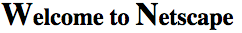
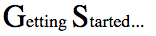
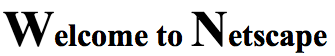
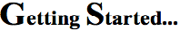
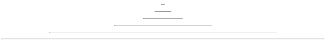
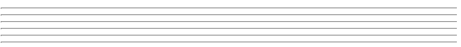
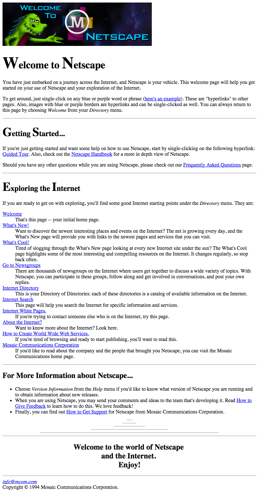

# Part 2: Bring Netscape into the Modern Web
## Objectives
* Learn to use `span`s and `div`s for CSS-friendly HTML markup
* Practice using CSS for styling text
* Use CSS pseudo-selectors to select elements based on DOM structure

**1. Get reacquainted with the HTML.**  
At the end of [part 1](Part1.md) you were given an HTML solution.
Make 100% sure that your `welcome2015.html` document matches this *exactly*.

* Open the `welcome2015.html` file for editing. Start at the top and compare your
HTML with the solution, line by line, and
note any deviations between your copy and the solution. Fix any differences
before moving on.
  > The purpose is to identify your mistakes and make sure you understand why
  they are mistakes.

* If you made any edits the commit your changes to Git with the summary comment
"Corrections based on visual inspection".

* Use copy and paste to replace your HTML document with the solution.
  > Yes, that means overwriting your HTML work, but it's not really lost. It's
  just an old version in Git. You can get it back at any time from GitHub.

* Commit your changes to Git with the summary comment "Official solution from Part 1".
  > Now, we are 100% sure that everyone has the same HTML.

**2. Use an embedded stylesheet to style the page.**  
* In the `head` of the document, add a new `style` element.
We're going to use it for our embedded stylesheet.

  ```html
  <HEAD>
    <TITLE>Welcome to Netscape!</TITLE>
    <META CHARSET="UTF-8">
    <style>

    </style>
  </HEAD>
  ```
* Just as a quick test that the stylesheet works, insert a rule to make all `h1` elements red.

  ```html
  <style>
      h1 {
        color: red;
      }
  </style>
  ```

  In preview, the text "Welcome to Netscape" should turn red.

* Delete the rule we just added. We know the CSS is being loaded properly.
  ```html
  <HEAD>
    <TITLE>Welcome to Netscape!</TITLE>
    <META CHARSET="UTF-8">
    <style>

    </style>
  </HEAD>
  ```

**3. Replicate the custom styling in the headers.**  
* Open the original `welcome1994.html` in preview (or just go [here](http://home.mcom.com/home/welcome.html)). We're looking to copy the exaggerated letter sizing of the headlines (h1, h2, etc.), which each have huge Capital letters followed by extra small lowercase letters.

  
  > Normally the lowercase 't' would be as tall as the 'W'.

  
  > Normally the 't' would be as tall as the 'S'.

  To make this work, we're going to have to go beyond just CSS, which is not really designed for this sort of typographic 'uglification'.

  **Close the `welcome1994.html` file. We're done with that for now.**

* Find the "Welcome to Netscape" headline on about line 18 of the `welcome2015.html` document. We're going to need to supersize the Capital letters of each word. We could use the `:first-letter` pseudo-class but that won't work in Firefox (because of a longstanding rendering bug in Gecko); instead we're going to use some `span`s that work in all browsers. The `span`s will allow us to apply styling to individual letters without affecting meaning of the text.
  > Look in preview and the text should still look the same. No spaces or other punctuation should be breaking up the words.

* Wrap a `span` element around each of the capital letters. Set the class of each span to 'big-capital'.
```html
<H1>
    <span class="big-capital">W</span>elcome
    to
    <span class="big-capital">N</span>etscape
</H1>
```

* Repeat the `big-capital` spans for the "Getting Started..." and "Exploring the Internet" headlines.

* In the stylesheet (i.e., in the `style` element) add a rule to make the text size of all `.big-capital` elements 60% larger than normal.

  ```css
    .big-capital {
      font-size: 160%;
    }
  ```
* The headlines should look this this:
  
  

**4. Center the "Welcome to the world of Netscape
and the Internet. Enjoy!" headline.**  

* Find the headline near the bottom of the document. That should be somewhere around line 130.
* Add the "centered" class to the `<h2>` tag.
  ```html
  <H2 class="centered">
    Welcome to the world of Netscape
    <BR> and the Internet.
    <BR>Enjoy!
  </H2>
  ```

* Add a new rule to the end of our stylesheet, just below the `big-capital` rule, to center any element with the class `centered`.
  ```css
  .centered {
      text-align:center;
  }
  ```

**5. Recreate the `hr` wedge just above the footer.**

In the original there was a sequence of `hr` elements styled to look like a wedge:
  

However, the styling was done using obsolete HTML attributes. After stripping out the bad attributes, we're left with this:
  

We're going to need to use CSS pseudo-classes to select and resize the `hr` elements to match the original.

Since the order of the `hr` elements matters -- we want the first one to be short, then longer for the second, etc. -- we will use the `:nth-child` pseudo-selector to say what to do with each `hr` in sequence.

* First, we'll need to group the entire sequence of `hr` elements with a `div` element. Use the class `decorative-wedge` so we know what to do with the group in CSS.
  ```html
  <div class="decorative-wedge">
    <HR>
    <HR>
    <HR>
    <HR>
    <HR>
  </div>
  ```

  To select the `hr` elements in the wedge (and only those elements), we'll use a descendant selector like this:
  ```css
    .decorative-wedge hr { ... }
  ```
  That way we are sure that only elements inside the `.decorative-wedge` are affected.

* We'll start with the first `hr` element. We want that one to be 2% of the width of a full-length `hr`. However, since the length of the second `hr` is going to be different, we'll need to specify that we want just the *first* `hr` inside the `.decorative-wedge`. The rule looks like this:
  ```css
  .decorative-wedge hr:nth-child(1) { width:2% }
  ```

  > Again, we're using our descendant selector, just with the `:nth-child(1)` pseudo-class on the `hr`.

* Repeat the rule for the second `hr`, this time with width of 5%.
```css
.decorative-wedge hr:nth-child(1) { width:2% }
.decorative-wedge hr:nth-child(2) { width:5% }
```

* Continue for the third, fourth, and fifth elements, with widths of 12%, 30%, and 70%, respectively.

**6. Check your work.**
* The finished page looks like this:
  

* Here's a complete copy of the finished HTML:

```html
<!DOCTYPE html>
<HTML>

<HEAD>
  <TITLE>Welcome to Netscape!</TITLE>
  <META CHARSET="UTF-8">
  <style>
    .big-capital {
      font-size: 160%;
    }
    .centered {
      text-align:center;
    }

    .decorative-wedge hr:nth-child(1) { width:2% }
    .decorative-wedge hr:nth-child(2) { width:5% }
    .decorative-wedge hr:nth-child(3) { width:12% }
    .decorative-wedge hr:nth-child(4) { width:30% }
    .decorative-wedge hr:nth-child(5) { width:70% }
  </style>
</HEAD>

<BODY>

  

  <H1><span class="big-capital">W</span>elcome</span> to <span class="big-capital">N</span>etscape</H1>

  <P>
    You have just embarked on a journey across the Internet, and Netscape is your vehicle. This welcome page will help you get started on your use of Netscape and your exploration of the Internet.
  </P>
  <P>
    To get around, just single-click on any blue or purple word or phrase (<a href="welcome_docs/example-link.html">here's an example</a>). These are "hyperlinks" to other pages. Also, images with blue or purple borders are hyperlinks and can be single-clicked
    as well. You can always return to this page by choosing
    <i>Welcome</i> from your <i>Directory</i> menu.
  </P>

  <HR>

  <H2><span class="big-capital">G</span>etting <span class="big-capital">S</span>tarted...</H2>
  <P>
    If you're just getting started and want some help on how to use Netscape, start by single-clicking on the following hyperlink:
    <A HREF="guided-tour.html">Guided Tour</A>. Also, check out the
    <A HREF="online-manual.html">Netscape Handbook</A> for a more in depth view of Netscape.
  </P>
  <P>
    Should you have any other questions while you are using Netscape, please check out our
    <A HREF="faq.html">Frequently Asked Questions</A> page.
  </P>

  <HR>

  <H2><span class="big-capital">E</span>xploring the <span class="big-capital">I</span>nternet</H2>
  <P>
    If you are ready to get on with exploring, you'll find some good Internet starting points under the
    <I>Directory</I> menu. They are:
</P>
    <DL>
      <DT>
        <A HREF="welcome.html">Welcome</A> </DT>
      <DD> That's this page -- your initial home page. </DD>

      <DT>
        <A HREF="whats-new.html">What's New!</A>
      </DT>
      <DD>Want to discover the newest interesting places and events on the Internet? The net is growing every day, and the What's New page will provide you with links to the newest pages and services that you can visit.</DD>

      <DT>
        <A HREF="whats-cool.html">What's Cool!</A>
      </DT>
      <DD>Tired of slogging through the What's New page looking at every new Internet site under the sun? The What's Cool page highlights some of the most interesting and compelling resources on the Internet. It changes regularly, so stop back often.
      </DD>

      <DT>
        <A HREF="newsrc:">Go to Newsgroups</A>
      </DT>
      <DD>There are thousands of newsgroups on the Internet where users get together to discuss a wide variety of topics. With Netscape, you can participate in these groups, follow along and get involved in conversations, and post your own replies.</DD>

      <DT>
        <A HREF="internet-index.html">Internet Directory</A>
      </DT>
      <DD>This is your Directory of Directories: each of these directories is a catalog of available information on the Internet.</DD>


      <DT>
        <A HREF="internet-search.html">Internet Search</A>
      </DT>
      <DD>This page will help you search the Internet for specific information and services.</DD>


      <DT>
        <A HREF="internet-white-pages.html">Internet White Pages.</A>
      </DT>
      <DD>If you're trying to contact someone else who is on the Internet, try this page.</DD>


      <DT>
        <A HREF="about-the-internet.html">About the Internet?</A>
      </DT>
      <DD>Want to know more about the Internet? Look here.</DD>

      <DT>
        <A HREF="how-to-create-mosaic-services.html">How to Create World
Wide Web Services.</A>
      </DT>
      <DD>If you're tired of browsing and ready to start publishing, you'll want to read this.</DD>

      <DT>
        <A HREF="http://mosaic.mcom.com/">Mosaic Communications Corporation</A>
      </DT>
      <DD>If you'd like to read about the company and the people that brought you Netscape, you can visit the Mosaic Communications home page. </DD>
    </DL>

  <HR>

  <H2>For More Information about Netscape...</H2>
  <UL>
    <LI>Choose <i>Version Information</i> from the <i>Help</i> menu if you'd like to know what version of Netscape you are running and to obtain information about new releases.
    </LI>
    <LI>When you are using Netscape, you may send your comments and ideas to the team that's developing it. Read
      <A HREF="how-to-give-feedback.html">How to Give Feedback</A> to learn how to do this. We love feedback!
    </LI>
    <LI>Finally, you can find out
      <A HREF="how-to-get-support.html">How
to Get Support</A> for Netscape from Mosaic Communications Corporation.
    </LI>
  </UL>

  <div class="decorative-wedge">
    <HR>
    <HR>
    <HR>
    <HR>
    <HR>
  </div>

    <HR>
    <H2 class="centered">
      Welcome to the world of Netscape
      <BR> and the Internet.
      <BR>Enjoy!
    </H2>


  <HR>

  <A HREF="mailto:info@mcom.com"><I>info@mcom.com</I></A>
  <BR> Copyright &copy; 1994 Mosaic Communications Corporation.
</BODY>

</HTML>

```

**7. Save your work.**
You're done. Commit to Git with the comment "Completed project" and then push to GitHub.
