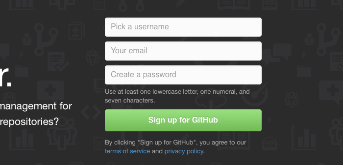
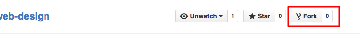
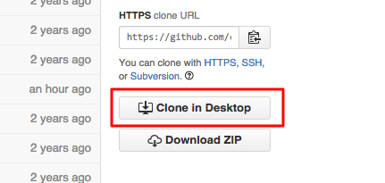
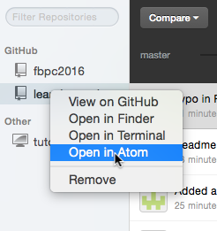
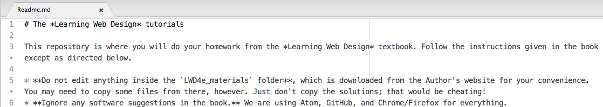
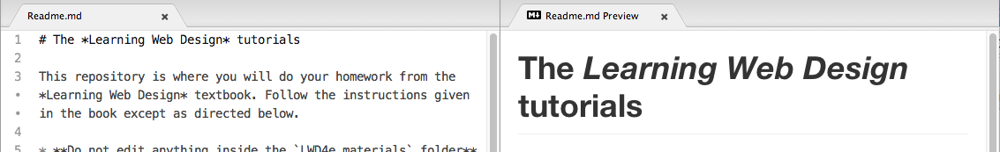

# Setup: Browsers, Accounts, Atom, Git, and GitHub

*The following is a step-by-step guide to setting up all the software tools you will need to use in this class. For convenience we will try to stick with online tools that can be used with just about any networked computer. Once we’ve got the software configured, we will also install the files needed to complete the tutorials in the Learning Web Design book.*

### Requirements
The following instructions assume the following hardware & software:
* A laptop or desktop computer with at least 1080p resolution (1920x1080). Most modern laptops meet this standard and the computers in the DSB labs are also plenty large.
* A thumb drive or hard disk with at least 2GB of free space. In using your own laptop then just make sure you have some free space on your drive. If using the lap computers then please bring your own thumb drive.
* A reasonably up-to-date operating system. On Macs, that means Mavericks or later. On Windows PCs, that means Windows 7, 8, 8.1, or 10.

## Set up Chrome, Firefox, and extensions.

1. Make sure you have the latest versions of Chrome and Firefox installed.
2. In Chrome, open a new tab and then go to Window → Extensions. Click the “Get more extensions” link at the bottom of the page. Find and install each of the following extensions and apps:
    * Web Developer (extension) by Chris Pederick
    * Lucidchart for Education (app) by Lucidchart.com
    * Pixlr Editor (app) by Pixlr.com
    * Lightshot (extension) by prntscrn.com

 *Note: if using a university-owned computer some of these extensions/apps may already be installed or you may not have permissions needed to install them. In either case just install what you can and then move on.*
3. In Firefox, go to Tools → Add-ons. Use the search box in the upper-right corner of the page to find and install the following extensions:
    * Web Developer (extension) by Chris Pederick
    * ColorZilla (extension) by Alex Sirota

 *The note about installing Chrome extensions also applies to Firefox extensions. Install what you can and move on.*
4. You will need to repeat the above on every computer you intend to use for this course.
5. Once you have Chrome and Firefox installed and configured, please use one or the other of these browsers for the rest of the session. That includes reading this document. **Internet Explorer does not always play nicely with the software used in this course. Do not use it for anything other than testing your pages. You've been warned.**

## Sign up for GitHub.
1. In this class you will be editing enormous text files where even one missing bracket ('>') or semi-colon (';') can completely break your web pages. You will at times be tempted to start over at the beginning, which is truly frustrating after you've entered a 3,000 line text file by hand. We'll be using Git and GitHub to keep the chaos to a minimum.

    [Git](https://git-scm.com) is a Version Control System that keeps track of changes you make to your files so you can *undo* them if needed. It can even *revert* your files to whatever was in them weeks or months before. It's like an undo button that can go back forever.

    [GitHub](https://github.com) is a place to backup and share Git *repositories*, which are collections of files that make up your projects. _If you know a professional web developer who has not used Git or GitHub then please do not listen to **any** advice they may give you for this course. Developers can be fired for not taking good care of their files, and you should not be working with people who will give advice that will get you fired._
2. Go to [GitHub.com](https://github.com) and sign up for a free account. So that you qualify for an account upgrade in the next step, be sure to use your Fairfield University email address. You do not have to initialize any repositories yet. We’ll do that in a later step.

    

3. Post your GitHub account information [here](https://docs.google.com/forms/d/1A7oq_6nTaOgUQWSDea50oLf5im--6i4u8adtuitWcOk/viewform) so that you can be added to the `fairfield-is135-fall2015` organization. Adding you to the organization may take a little time, but hopefully we’ll have this done by the end of class.
4. Once you’ve been added to the `fairfield-is135-fall2015` organization, you will see it listed in your GitHub dashboard the next time you load the page.

## Install the GitHub Desktop app.
1. [GitHub Desktop](https://desktop.github.com) makes using Git and GitHub *a lot* easier, especially for people who don't program for a living. Without it you would have to enter lots of cryptic Git commands and hope that you didn't misspell something important. GitHub Desktop  also takes care of connecting your repositories to GitHub without having to reenter your password all the time (or deal with SSH keys).
2. Download and install GitHub Desktop.
3. Open the app. You should be asked to set your identity in the preferences. If not (e.g., somebody, not you, has already done that) then open the preferences manually. Then i) link in your GitHub account on the `Accounts` tab and ii) set your full name and email address on the `Advanced` tab. You may also need to `Install Command Line Tools` on the Advanced tab.

## Install the Atom Editor.
1. Go to the [Atom.io](https://atom.io) and read about all of Atom's killer features.
2. Check to see if you already have Atom installed. If not, then download and run the installer.
3. We'll be using Atom in a few minutes. Sit tight for now.

## Fork and then clone the Learning Web Design repository.
1. You can find the repository at https://github.com/christopherhuntley/learning-web-design.
2. Click the fork button the upper-right-hand corner of the page to make a copy of the repository on your GitHub account.

    

3. When asked where to create the new repository, **choose your GitHub account**. Do not select the class's GitHub organization. **If you fork it to the organization account by accident, then please delete your forked copy (or ask the instructor for help).**
4. Click the `Clone in Desktop` button to create a *local copy* of the repository on your computer.

    

    If you get an error message about Git not being installed, then click the `Install Command Line Tools` button in the GitHub Desktop preferences.  

5. Create the new repository folder on your hard drive or (a thumb drive if you are using a lab computer). To keep things simple, it is recommended to keep all your repositories inside a `GitRepos` folder so you mix them up with other things.
6. The repository should now appear in GitHub Desktop.

## Make your first Git Commit and Push to GitHub.
1. In GitHub Desktop right-click (control-click on a MacBook) on the *learning-web-design* repository to `Open in Atom`. An Atom window should appear, ready for you to start editing.

    

    If that doesn't work then just open up Atom yourself and then manually open the *learning-web-design* repository folder  (`File`→`Open...`, etc.).

2. Open the `Readme.md` file. You will see some plain text with # and * interspersed for formatting. This is Markdown, a formatting language used for writing documentation in plain text. That's what the `.md` means in the filename. GitHub automatically converts Markdown text to HTML for displaying in your web browser.  

    

3. From the menus select `Packages`→`Markdown Preview`→`Toggle Preview` to see what the file looks like on GitHub. If you edit the file, then the preview updates automatically.

    

4. Read the file, which gives instructions for completing the textbook tutorials. Ask questions if you do not understand something.
5. At the bottom of the file add the following text on a new line. Be sure to replace `[skip a line]` with a blank line in your file. Otherwise the text will just flow onto the back of the last bullet item.  

    ```
    [skip a line]
    *I have read and understand the above instructions. *
    ```
    You should see the new text appear in italics at the bottom of the preview. Save your changes.
6. Go back to GitHub Desktop. You should see the changes highlighted on the right.
    
7. Type the following commit comment into the `Summary` field:

    ```
    Signed off on the instructions.
    ```
8. Click the `Commit to Master` button to save a new version to your local Git repo. Now you have the changes tracked on your computer. If you click the `History` button at the top of the window then you can see every commit ever made to the repository, including your own.
9. Click the `Sync` button in the right-hand corner of the window to *push* your changes to GitHub.
