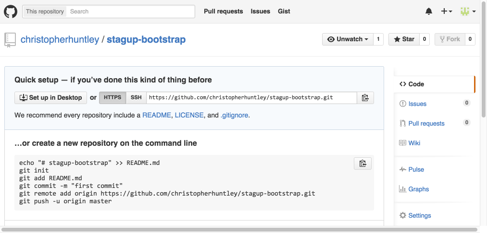
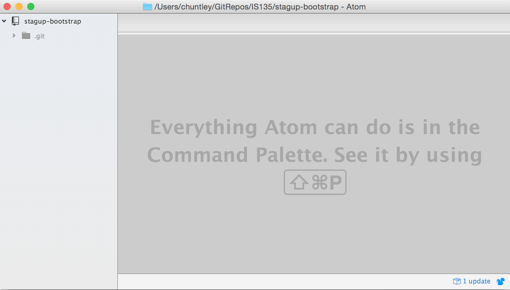
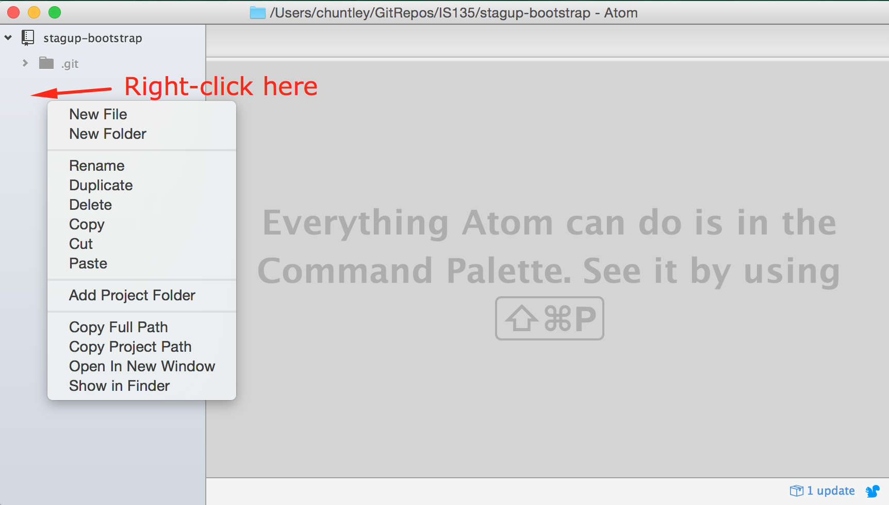
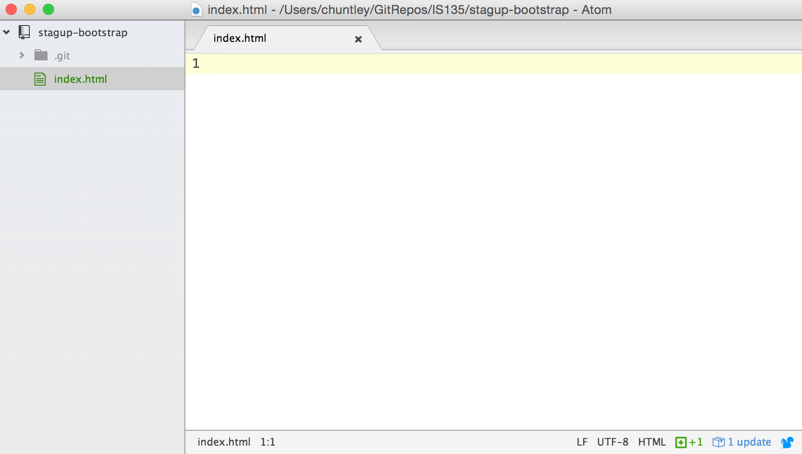
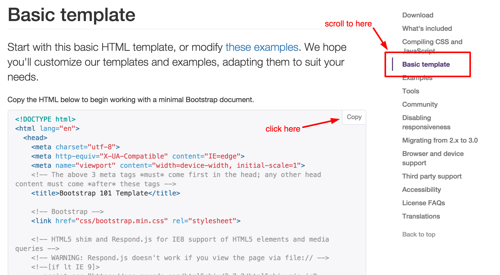
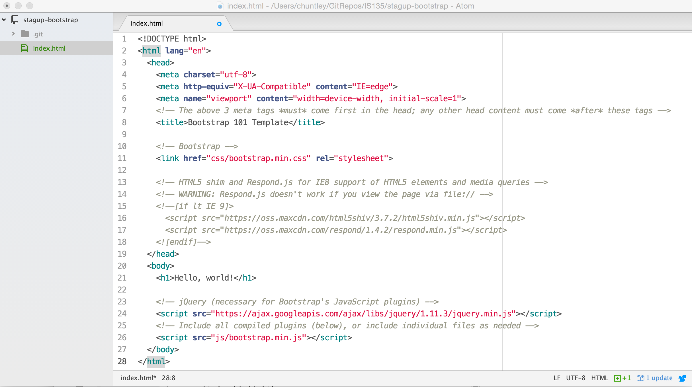
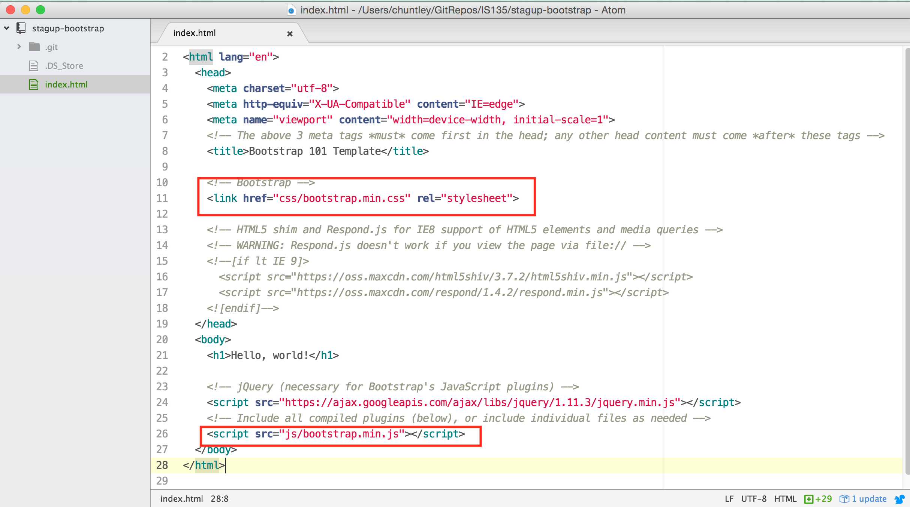
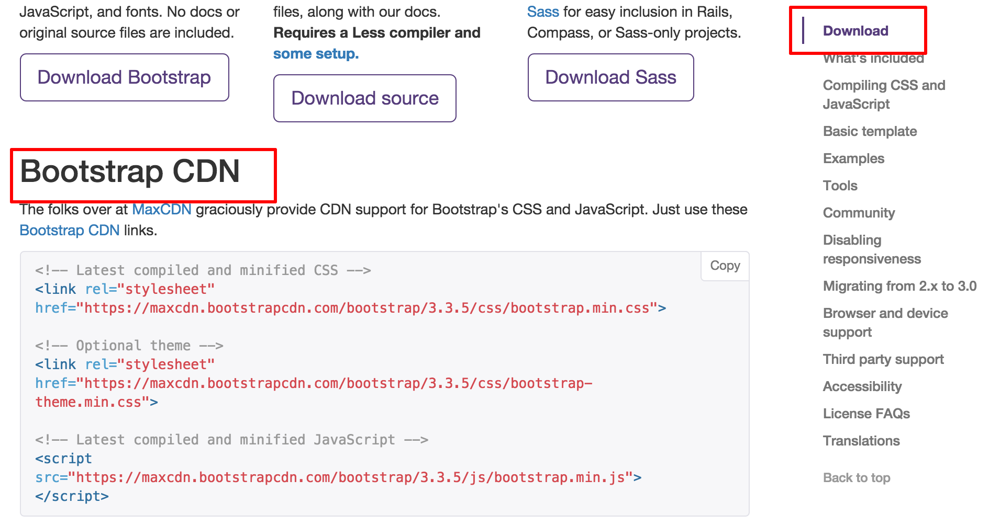

# StagUp Bootstrap Part 1: Setup
## Objectives
* Set up a new Git repository and publish it to GitHub
* Start a new Bootstrap-based website project from scratch
* Create and debug your first Bootstrap page
* Learn about Content Distribution Networks

**1. Create your project folder and Git repo.**  
  * In GitHub Desktop create a new local Git repository by clicking the plus sign in the upper-left-hand corner, selecting Create, and entering the name `stagup-bootstrap`.      
    

  >Take care where you are creating the new repository folder. It should not be a subfolder of a another Git repository. The `IS135` folder pointed to by the arrow above is **not** a repository. It is just a regular folder where IS135 repositories are kept.

  * Publish the Git repo to GitHub. It should now appear in your GitHub account as an empty repository folder.   

  

  >You can ignore whatever GitHub says about the empty repository for now. We'll add an `index.html` file in a few minutes but we haven't written it yet. Then we can publish it to make GitHub happy.

**2. Set up the basic HTML using the Bootstrap 'boilerplate' template.**  
  * Open the project folder in Atom.

  

  * Create a new (blank) `index.html` file.

  

  (and then create the `index.html` file)

  

  * Go back to the Bootstrap website in your browser. On the 'Getting Started' page, scroll down to the 'Basic Template.' Once there copy the HTML to your clipboard.

  

  * Back in Atom, paste the HTML you just copied into the `index.html` file.

  

  >We call this kind of template 'boilerplate' because it is very generic. Just about every bootstrap project starts out this way. It's like the metal label you find on your hot water heater. They are pretty much *always* the same regardless of who makes the water heater.

**3. Debug the template code.**  
  * Preview your new `index.html` file. It will look like this:

  

  Unfortunately, there is a bug in our code (yes, already) preventing Bootstrap from loading correctly.

  >We can tell there is a problem because the font is wrong. It's supposed to look like the font used on the Bootstrap website. Details like this matter. Imagine if we'd done a bunch of work and could not figure out why none of our Bootstrap code seemed to work? It's always better to look for and fix bugs as soon as you can.

  The problem is that the boilerplate code assumed that we had already downloaded the Bootstrap files and organized our folders like the examples. So, the HTML is looking for files that don't exist.

  The offending lines are boxes below:

  

  >The first boxed code tries to load a missing CSS stylesheet. The second boxed code tries to load a missing Javascript file.

  * Go back to the Getting Started page on the Bootstrap website and scroll back up to the "Download" section. You should see a subsection called "Bootstrap CDN".

    

  >A content distribution network (CDN) is used to serve up files that lots of people want to download all at once. Instead of storing these files on a single server that might be located on the other side of the world (and maybe 1 second away on the internet), a CDN keeps copies on lots of servers and the one that can get the files to you the fastest. It's quite a neat way to speeed up the web.

  Instead of downloading the files, setting up the required folders, etc., we'll just use copies of the files supplied by the Bootstrap CDN.

  * In your `index.html` go to line 11, the one with the bad CSS link:
  ```html
    <link href="css/bootstrap.min.css" rel="stylesheet">
  ```
  > Note that `href` is pointing to the a file called `bootstrap.min.css` inside a folder called `css`. No such file or folder exist. That's the bug.

    Replace line 11 (all of it) with this code for Bootstrap CDN's copy of the CSS file:
    ```html
    <link rel="stylesheet" href="https://maxcdn.bootstrapcdn.com/bootstrap/3.3.7/css/bootstrap.min.css" integrity="sha384-BVYiiSIFeK1dGmJRAkycuHAHRg32OmUcww7on3RYdg4Va+PmSTsz/K68vbdEjh4u" crossorigin="anonymous">
    ```
    >Note how the new link uses a full, absolute URL, complete with the `https` protocol in front. That's because the file is actually loaded directly from the CDN without ever touching your hard drive.

  * Go to line 26, the one with the bad Javascript link:
    ```html
    <script src="js/bootstrap.min.js"></script>
    ```

    Replace that line with the code for Bootstrap CDN's copy of the Javascript file:
    ```html
    <!-- Latest compiled and minified JavaScript -->
<script src="https://maxcdn.bootstrapcdn.com/bootstrap/3.3.7/js/bootstrap.min.js" integrity="sha384-Tc5IQib027qvyjSMfHjOMaLkfuWVxZxUPnCJA7l2mCWNIpG9mGCD8wGNIcPD7Txa" crossorigin="anonymous"></script>
    ```

  * The 'Hello world!' text should now look like this:  
      
    Go back to step 2 and see how that's changed.

**4. Commit and push your work to GitHub.**  
  Use the commit summary comment 'Completed part 1'. Push (sync) as usual to GitHub.
