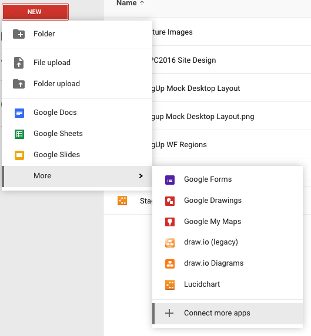
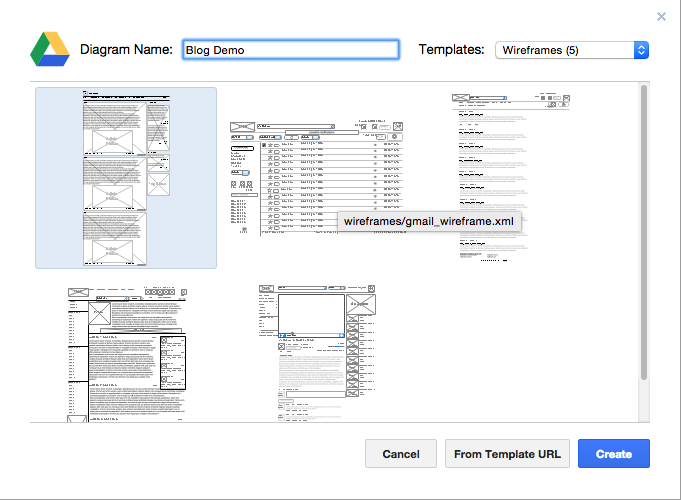
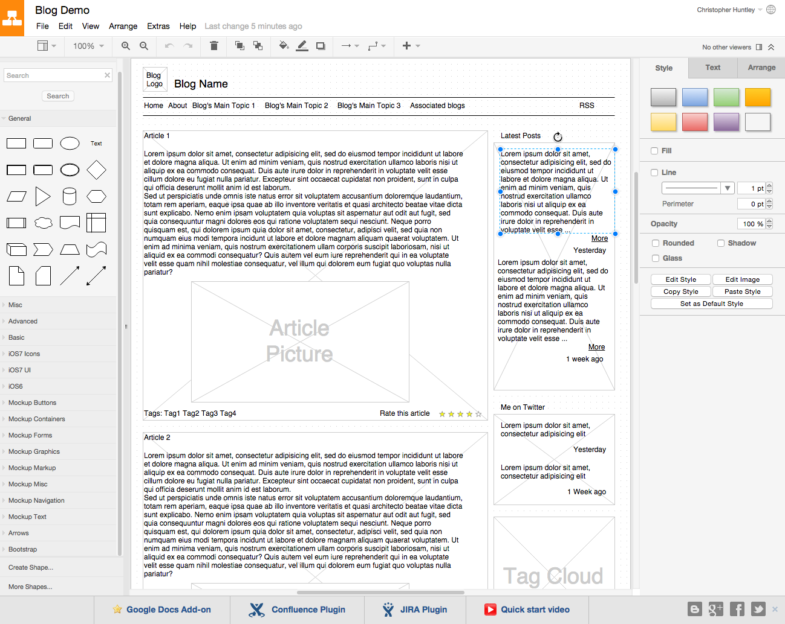
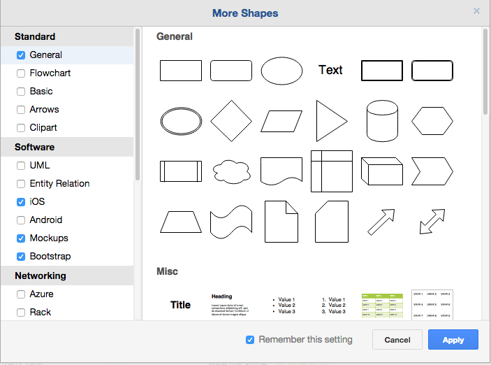
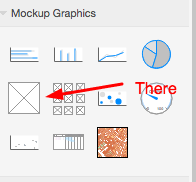
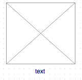
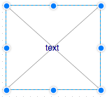
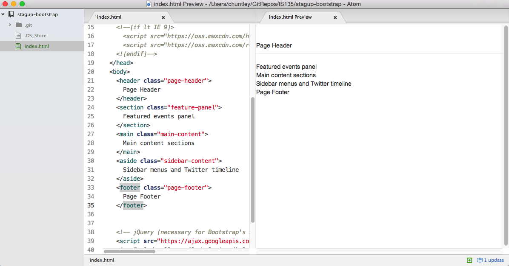
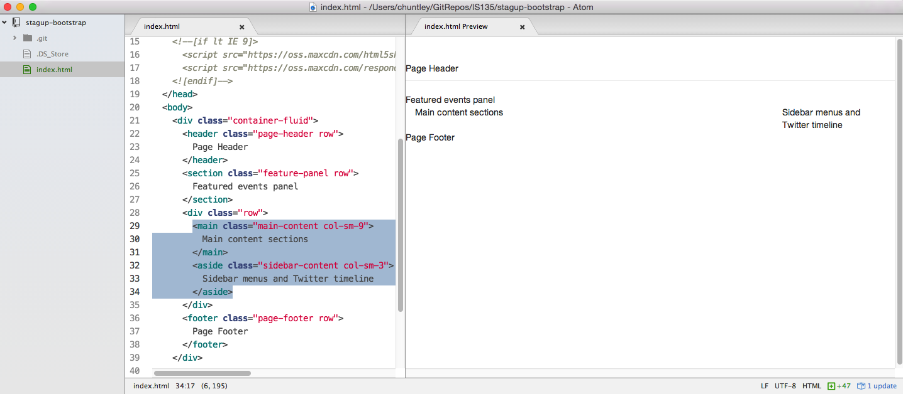
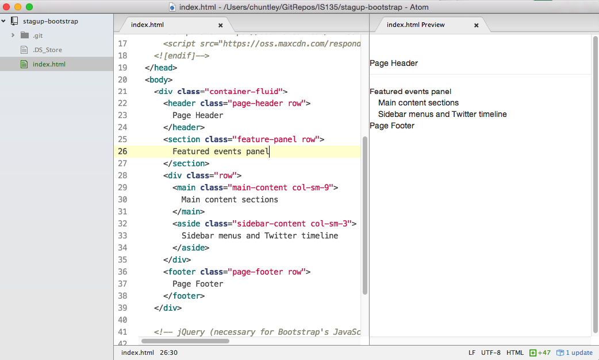

# StagUp Bootstrap Part 2: Layout, Sectioning, and Grids
## Objectives
* Explore the Draw.io Diagrams package
* Analyze a wireframe to identify structure
* Define a page template based on the wireframe
* Apply the Bootstrap grid framework to the new template

**1. Edit a wireframe sketch in Draw.io.**  
  >When creating a new website, it is customary to sketch your ideas out first. These drawings can be very rough, often little more than some boxes, pictographs, and perhaps some text that express just the *bare essentials* of your vision. We call these early sketches "wireframes" because of the way the boxes are strung together on the page.

  >Wireframe sketches are intentionally vague, as rough as you can possibly get away with and not more. If they weren't, then you might get stuck trying to make a bad design work just because you spent so much time drawing it. Besides, beautiful artwork can mask bad design in the first place, making it even more likely that you will make bad decisions that will take even longer to undo later. This is what artists really mean by "painting yourself into a corner."

  >[Draw.io Diagrams](https://www.draw.io) is a free tool for creating wireframes online. It can read and write from/to Google Drive and includes just enough shapes and style options to sketch out a web layout.

  * Create a new folder called `Draw.io Demo` in your Google Drive.  Open the folder. From the `New` menu in the upper-left corner of your screen, select `More` → `+ Connect More Apps` to open up the Google Apps search screen. Search for 'Draw.io Diagrams' and then connect it to your account.

    

    >  
    > Afterwards, make sure you are in the `Draw.io Demo` folder.
    >  

  * Use the `New` menu to create a new Draw.io diagram. Select `Wireframes` from the Templates dropdown. You should get 5 demo wireframes to choose from. Select the first one and name your diagram 'Blog Demo'.
    

  >After some swirly magic the diagram should appear.

  >  
  >
  >The diagram is displayed in the center panel and is completely editable with assitance from the panels on either side. The left panel displays shapes you can drag onto the diagram. The right panel allows you to set formatting options for the currently selected shape. Shapes can be resized in the usual way by dragging a the handles on the corners.

  * Take some time clicking around to see how the wireframe was created.
  >You'll see that the same shape was used over and over again, a box with crossed wires connecting the corners. These are used as placeholder for the actual shapes. There might also be gray text label across the top used to say what the box represents. Black text is used as placeholder content, to show very approximately where the content would be placed on the page. There are also a few simple lines and bits of text used to indicate menus.  

  > **Unfortunately, the actual wireframe box shape is not among the shapes in the left panel. We'll see in a minute how to create our own.**

  * To make Draw.io useful for web wireframes and mockups, we'll need to add some useful shape libraries. From the Draw.io menu select `File`→`More shapes...`. Select the `General`, `iOS`, `Mockups`, and `Bootstrap` libraries.

    

  * Find the wireframe box in the `Mockup Graphics` shapes. You may have to click to expand the shape list.

    

  > That's the shape that was used to create the boxes!

  * Drag the shape to your diagram and then double-click it to add a label.
  > Oops. The label appears below the box instead of in the middle.

    

  * In the formatting panel on the right choose the `Text` tab. Then set the `position` to `center` to get the label to appear in the center of the box.

    

> **Believe it or not, that is all you really need to do to create a wireframe. Just add some icon placeholders with labels to indicate the relevant areas of your layout. Perhaps add extra text and simple shapes to represent other essential elements of your layout.**  

**2. Analyze the StagUp Wireframe to identify structure.**  

* Study the wireframe for the StagUp site below. It captures the essential layout of the page with just a few rectangular boxes and labels. In fact, there is no artwork at all.

  

>The wireframe can be made even simpler if we aggregate the wireframe boxes into *regions* of the page:

  

* Here is a more complete *mockup* of the same page, with semi-finished styling instead of just the wireframe boxes. (It was also created with Draw.io using the Bootstrap and Mockup shapes we added a bit ago.) Take a moment to compare it with the wireframes.

  

  >While nice, the mockup does not actually provide us with much more information about the page structure than the wireframe! It will become useful later on, but for now we can get away with just the wireframe displaying the regions.

**3. Edit the HTML to match the wireframe.**
>At this early stage of the design, there is no need yet to get into the specific HTML for creating navbars, panels, etc. Instead, we will content ourselves with defining the regions where these elements will eventually reside.

>The actual StagUp website uses a slightly more complex set of regions. We'll keep things simple, however, and just use the ones from our wireframe sketch.  
>
>

* Open up the `index.html` file in Atom. Ignoring the `script` elements at the bottom, which are needed by Bootstrap, the body of the document is just one `h1` element on about line 21:

  ```html
  <h1>Hello, world!</h1>
  ```
Delete this line (and only this line). We'll be replacing it with our new wireframe regions.
* Add a new `header` element with class `page-header` at the top of the `body`:

  ```html
  <header class="page-header">
  </header>
  ```
  > If you preview the page, you'll see absolutely nothing. Block elements like `header` are generally invisible if they don't contain any visible content.

  Add a bit of text as a placeholder for the actual `page-header` content:

  ```html
  <header class="page-header">
    Page Header
  </header>
  ```
  >This is where we will create the navbar that appears at the top of every page.

* Add a new `section` for the featured content just below the `header`:
  ```html
  <section class="feature-panel">
    Featured Events Panel
  </section>
  ```
  >This section's location at the top of the page makes it the first thinsg users will lock on when they open the page. We're using it to feature upcoming events, with a signup button displayed on the next event.

* Add a `main` section just below that:
  ```html
  <main class="main-content">
    Main content sections
  </main>
  ```
  >This is where the column of content panels for the teams, the sponsors, etc. will go.

* Next, add an `aside` section for the content menus:
  ```html
  <aside class="sidebar-content">
    Sidebar menus and Twitter timeline
  </aside>
  ```
  >The sidebar is for the content menus and the Twitter timeline. Calling it a sidebar is a bit of misnomer on mobile, where the menus would normally appear below the main content and above the footer.

* Finally, add the footer to the bottom, just above the `<script>` tag:
  ```html
  <footer class="page-footer">
    Page Footer
  </footer>
  ```

>Yes, that's all there is to it. You should see this in your Atom window:


**4. Add Bootstrap markup and classes.**  
>Now we finally get to some actual Bootstrap code. We're going to use Bootstrap's [Grid System](http://getbootstrap.com/css/#grid) to lay out the regions in a way we can change later without editing the HTML again.

* Open up the [Bootstrap Grid docs](http://getbootstrap.com/css/#grid) so you can read along as we add the required HTML and CSS.

  As the docs explain pretty well, the Grid System is a way to organize your page elements into rows and columns that can adjust automatically for different device widths. To make it work, however, we have to follow the rules spelled out in the docs. For the most part, all we have to do is add some special classes to our existing HTML elements, while in a few cases we will also need to add "wrapper" elements as required by the rules.

* The first rule is that the grid must be inside a `container` or `container-fluid` wrapper. For our purposes, we'll want a `container-fluid` so we don't get white 'sidewalls' on either side of our pages. We'll need to add some extra HTML that wraps a `div` around our existing regions, like this:
  ```html
  <div class="container-fluid">
    <header class="page-header">
      Page Header
    </header>
    <section class="feature-panel">
      Featured events panel
    </section>
    <main class="main-content">
      Main content sections
    </main>
    <aside class="sidebar-content">
      Sidebar menus and Twitter timeline
    </aside>
    <footer class="page-footer">
      Page Footer
    </footer>
  </div>
  ```

  >Note that `container-fluid` is a `class` instead of an `id`. That's so we can reuse it if our page has several sections that don't share the same grid.

* Add a `row` class to the `page-header`, `feature-panel`, and `page-footer` elements. Leave the `main-content` and `sidebar-content` alone for now. You can specify as many classes you like for any given HTML element; just make sure to separate the class names with spaces. (That's why class names can't have spaces in them, by the way.)
  ```html
    <div class="container-fluid">
      <header class="page-header row">
        Page Header
      </header>
      <section class="feature-panel row">
        Featured events panel
      </section>
      <main class="main-content">
        Main content sections
      </main>
      <aside class="sidebar-content">
        Sidebar menus and Twitter timeline
      </aside>
      <footer class="page-footer row">
        Page Footer
      </footer>
    </div>
  ```

* Because the `main` and the `aside` appear on the same row in our wireframe, we'll need to wrap them together inside a `div` like this:
  ```html
    <div class="row">
      <main class="main-content">
        Main content sections
      </main>
      <aside class="sidebar-content">
        Sidebar menus and Twitter timeline
      </aside>
    </div>
  ```

* The final rule is that each element on the same row has to specify how wide it wants to be. Bootstrap does this using "column" classes that work like the `colspan` attribute of a table cell. Each row of a Bootstrap grid is divided into twelve equal-width columns with 15px padding to provide some whitespace. Each element on the row then just has to say how many columns it wants. If they elements on a row altogether ask for more than 12 columns, then the extra elements wrap (drop) to the next line.
    > Why 12 columns? Because 12 is divisible by 2, 3, 4, and 6.

    Add a `col-sm-9` class to the `main` and a `col-sm-3` class to the `aside`. The other rows don't require any column classes.
    ```html
    <main class="main-content col-sm-9">
      Main content sections
    </main>
    <aside class="sidebar-content col-sm-3">
      Sidebar menus and Twitter timeline
    </aside>
    ```

    >This will create a 3/4 and 1/4 split between the main content and the sidebar on *desktop* computers.
    > 

    >On narrow mobile devices, almost as if by magic, each element will take 12 columns, with the sidebar appearing just below the main content.
    >

    >Note: There is 15px margin to the left of the first column on a row and 15px margin to the right of the last column on a row. This can cause elements to not align correctly in some mobile layouts, but is easily correctable with a few lines of CSS.

**5. Save your work.**  
Commit to Git. Use the commit summary 'Completed part 2'. Push (sync) as usual to GitHub.
