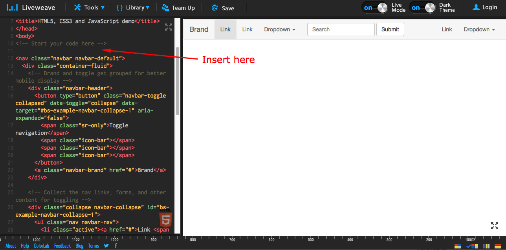
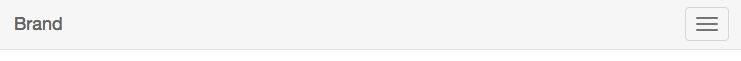
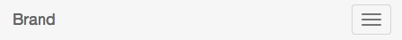
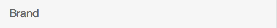
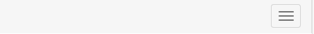
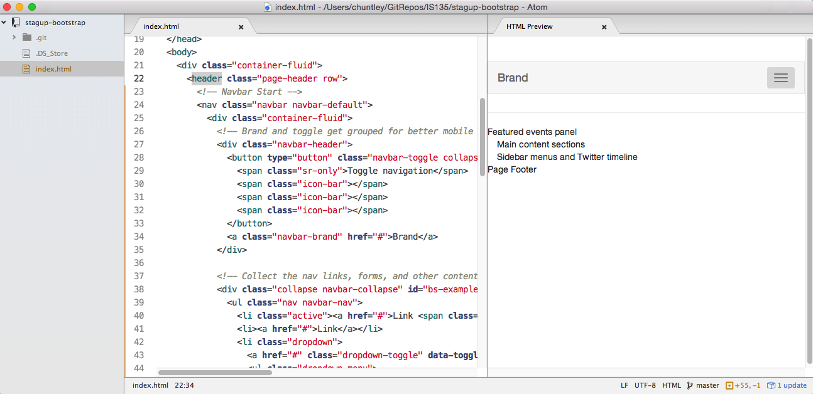
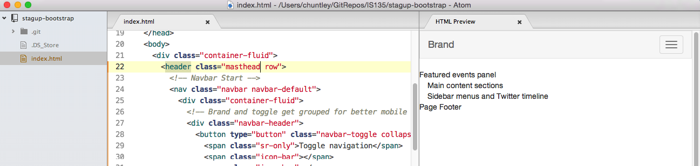
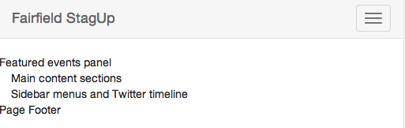
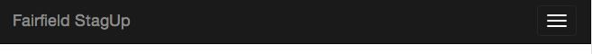

# StagUp Bootstrap, Part 3: Navbars

## Objectives
* Create your first Bootstrap component
* Use snippets and commenting out to isolate code so you can study it

**1. Check your work.**  
Your `index.html` should look exactly like this:

```html
<!DOCTYPE html>
<html lang="en">
  <head>
    <meta charset="utf-8">
    <meta http-equiv="X-UA-Compatible" content="IE=edge">
    <meta name="viewport" content="width=device-width, initial-scale=1">
    <!-- The above 3 meta tags *must* come first in the head; any other head content must come *after* these tags -->
    <title>Bootstrap 101 Template</title>

    <!-- Bootstrap -->
    <link rel="stylesheet" href="https://maxcdn.bootstrapcdn.com/bootstrap/3.3.5/css/bootstrap.min.css">

    <!-- HTML5 shim and Respond.js for IE8 support of HTML5 elements and media queries -->
    <!-- WARNING: Respond.js doesn't work if you view the page via file:// -->
    <!--[if lt IE 9]>
      <script src="https://oss.maxcdn.com/html5shiv/3.7.2/html5shiv.min.js"></script>
      <script src="https://oss.maxcdn.com/respond/1.4.2/respond.min.js"></script>
    <![endif]-->
  </head>
  <body>
    <div class="container-fluid">
      <header class="page-header row">
        Page Header
      </header>
      <section class="feature-panel row">
        Featured events panel
      </section>
      <div class="row">
        <main class="main-content col-sm-9">
          Main content sections
        </main>
        <aside class="sidebar-content col-sm-3">
          Sidebar menus and Twitter timeline
        </aside>
      </div>
      <footer class="page-footer row">
        Page Footer
      </footer>
    </div>

    <!-- jQuery (necessary for Bootstrap's JavaScript plugins) -->
    <script src="https://ajax.googleapis.com/ajax/libs/jquery/1.11.3/jquery.min.js"></script>
    <!-- Include all compiled plugins (below), or include individual files as needed -->
    <script src="https://maxcdn.bootstrapcdn.com/bootstrap/3.3.5/js/bootstrap.min.js"></script>
  </body>
</html>
```

**2. Learn about Navbars**

  * Go to the section on [Navbars](http://getbootstrap.com/components/#navbar) in the Bootstrap docs. Scroll down to the 'Default Navbar', which has a nice example designed to show just about every possible configuration option.  
  >Fortunately, we won't need anything this elaborate for our project.
  
  * Use the `copy` button to the right of the example HTML code to add it to your clipboard.
  * In a new Incognito / Private Window, open up a blank [Liveweave snippet](http://liveweave.com/). Then select 'Bootstrap' from the Libraries menu.
    > Why Incognito? So that Liveweave starts from scratch instead of pulling up an old weave.

  * Paste the Bootstrap HTML (from the clipboard) just below the `<!-- Start your code here -->` comment in the Liveweave HTML panel. You should delete the 'Hello Weaver!' placeholder text as well.

    

    > Narrow your browser window a little and the navbar will automatically change over to a mobile navigation menu with a 'hamburger' button on the right. Click the button to see the menu items as a vertical list.

    > 

    > So, here we have created a short, isolated snippet that we can edit without affecting our real code. Next we'll see how to do it in Atom using a temporary file and debugging comments.
  * In Atom, create a new file called `navbar.html` inside your project folder. Copy the full HTML from Liveweave into the new file.
  > We're going to use it take apart the example navbar code in Atom to see how it works. You can close Liveweave for now.

  * We'll start from the top, with the `nav`.

  ```html
  <nav class="navbar navbar-default">
      <div class="container-fluid">
      ...
      </div>
  </nav>
  ```
  As you can see, it has two classes, `navbar` and `navbar-default`, that identify it to Bootstrap. The `navbar` class is generic, used to pick up styling for all kinds of navbars. The `navbar-default` class is more specific, and tells Bootstrap to apply the default 'gray background and black text' styling. The `div` nested inside is for layout purposes, with a `container-fluid` class used to make the navbar extend edge to edge of the page.
  > We also used `container-fluid` in Part 2.

  * Next is the `navbar-header`, which contains a `button` and a link (`a`).   
  ```html
    <div class="container-fluid">
      <div class="navbar-header">
        <button type="button" class="navbar-toggle collapsed"
          data-toggle="collapse" data-target="#bs-example-navbar-collapse-1" aria-expanded="false">
          <span class="sr-only">Toggle navigation</span>
          <span class="icon-bar"></span>
          <span class="icon-bar"></span>
          <span class="icon-bar"></span>
        </button>
        <a class="navbar-brand" href="#">Brand</a>
      </div>
      ...
    </div>
  ```
  The `navbar-header` class tells Bootstrap that the code inside is what is displayed by default on mobile devices.

  

  > Why is mobile layout the default? Bootstrap is 'mobile-first,' of course.

  * The `button` element is for the "hamburger" menu on the right. It has two classes, `navbar-toggle` and `collapsed`, that say what kind of button it is (i.e., a 'toggle' switch) and what the initial state of menu is ('collapsed', with just the button showing). The `button` also has two 'data' attributes, `data-toggle` and `data-target`, that are used by Javascript to control how the menu works. Just inside the button are four `span` elements, the last three of which form the three horizontal lines on the button's label. The first span is marked as `sr-only`, which means that it would be read aloud by screen-reader software but is invisible to everbody else.

  * The link is actually for branding. It's customary for the logo on a website to be clickable, returning the user back to the home page.

  * [Comment out](http://www.w3schools.com/html/html_comments.asp) the `button` as shown below. (Just select the `button` element -- all of it -- and then select `Toggle Comments` from the `Edit` menu.)
  ```html
    <div class="container-fluid">
      <div class="navbar-header">
        <!--
        <button type="button" class="navbar-toggle collapsed"
          data-toggle="collapse" data-target="#bs-example-navbar-collapse-1" aria-expanded="false">
          <span class="sr-only">Toggle navigation</span>
          <span class="icon-bar"></span>
          <span class="icon-bar"></span>
          <span class="icon-bar"></span>
        </button>
        -->
        <a class="navbar-brand" href="#">Brand</a>
      </div>
      ...
    </div>
  ```
  The hamburger button disappears.

  

  Uncomment the `button` (by removing the `<!--` and `-->` or using `Toggle Comment` again) so the button reappears.
  * Comment out the link.
  ```html
  <!-- <a class="navbar-brand" href="#">Brand</a> -->
  ```

  As expected, the logo text disappears.

  

  Uncomment the link to get the logo back.

  * Use the commenting/uncommenting technique to explore the `div` just below the comment `<!-- Collect the nav links, forms, and other content for toggling -->`.

    The contents are really just a unordered list, a form, and another unordered list. The lists each contain a set of links (one `a` per `li`), with a nested sublist used for a `dropdown` menu. The form in between is also pretty standard. The classes `navbar-left` and `navbar-right` are then used to for aligning the three parts.  

**3. Create your own Bootstrap Navbar.**
  * Open your `index.html` for editing. We're going to build our own navbar, starting with the example code.
  * Inside the `header` add two HTML comments to indicate where our navbar starts and ends.
  ```html
  <header class="page-header row">
    <!-- Navbar Start -->

    <!-- Navbar End -->
  </header>
  ```
  * Copy the "Default Navbar" HTML code again from the Bootstrap docs. Paste it between your comments in Atom.

    

    >That actually worked! However, before we go on let's deal with the white strip above the Navbar. We don't want that.

    >The white strip is caused by the `page-header` class applied to the `header`. Bootstrap includes special styling for page headers, applying lots of white space to keep them separate from the rest of the page.

  * Replace the `page-header` class in the `<header>` tag with `masthead`, which doesn't have any special meaning to Bootstrap.

    
    > That's better. Now for the hard part. You'll need to pay close attention to what you are doing in this next step. It gets a little tricky.

  * Cut out the `form` and the second `ul` from the `navbar-collapse`. Then cut out the `dropdown` list item that remains. You should be left with the following:

  ```html
  <!-- Collect the nav links, forms, and other content for toggling -->
  <div class="collapse navbar-collapse" id="bs-example-navbar-collapse-1">
    <ul class="nav navbar-nav">
      <li class="active"><a href="#">Link <span class="sr-only">(current)</span></a></li>
      <li><a href="#">Link</a></li>
    </ul>
  </div><!-- /.navbar-collapse -->
  ```
  * Find the line with the `navbar-brand`. Change the linked text to "Fairfield StagUp".
    ```html
    <a class="navbar-brand" href="#">Fairfield StagUp</a>
    ```

    

  * In the `nav` element at the top of the navbar, replace the `navbar-default` class with `navbar-inverse`. The colors become inverted, with light text on a dark gray background.

  

  > How did we know to do that? By reading the docs, of course. We just used  Bootstrap's [Inverted navbar](http://getbootstrap.com/components/#navbar-inverted) color scheme.

  * Now that we are done with the navbar, delete the `navbar.html` file so it doesn't polute our Git repo.

**4. Save your work.**
Commit to Git. Use the commit summary 'Completed part 3'. Push (sync) as usual to GitHub.
