# StagUp Bootstrap, Part 4: Images, Typography, and Buttons

## Objectives
* Organize reusable assets (css files, artwork, javascript libraries)
* Use a responsive grid to layout content
* Insert a full-width background image
* Use Bootstrap typographic classes
* Create a call to action button

**1. Create an `assets` hierarchy.**  
  Thanks in part to the widespread adoption of [Content Management Systems (CMS)](https://en.wikipedia.org/wiki/Content_management_system) like [Wordpress](http://wordpress.org) and [Drupal](http://drupal.org) *that write HTML for us on demand*, it has become customary to think of the layout and styling of a website as reusable from one site to the next. That allows a designer to create a "starter" set of layouts and styles and then adapt them for use with nearly every client. You have actually seen this on the Bootstrap website, which features a set of [example starter designs on its Getting Started page](http://getbootstrap.com/getting-started/#examples).

  Such reusable designs are called "themes" because they define the *overall look and behavior of a site* without preventing the designer from customizing to suit the specific needs of a given site. Themes are treated like software with releases, bug fixes, etc. and should be separated from the rest of the site. That way we can replace them with newer versions when they are released without accidentally modifying our custom code.

  Even if we are not using a CMS or a prebuilt theme, it's best practice to separate our HTML documents from the artwork, stylesheets, and javascript. That way if we decide to go the CMS route later on we can do so easily.
* Open your project in Atom.
* Create a new folder called `assets`.
* Inside the `assets` folder, create three subfolders: `images`, `css`, and `js`.
  > The `images` and `css` folders are self-explanatory. The `js` folder is for any Javascript libraries we might want to add later.
* Within the `css` folder create a blank file named `styles.css`.
  > This is where we will put our custom overrides to Boostrap's default styling.
* In your browser, right-click on each of the following images to save them as new files in your `assets/images` folder:

  

  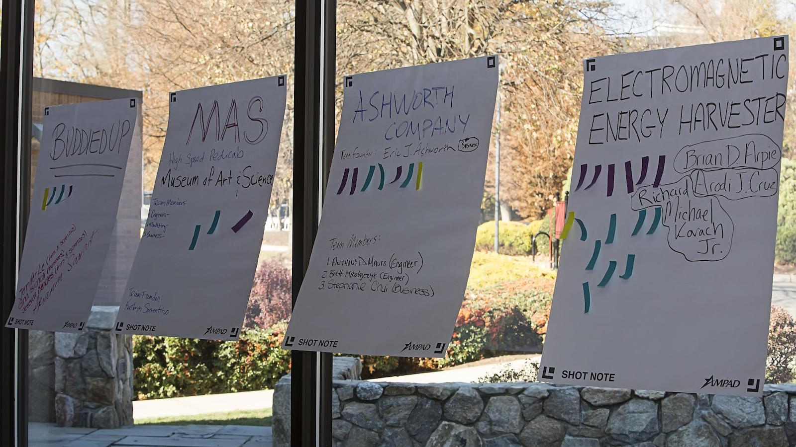

**2. Add the logo to the navbar.**
* Scroll down to the `.navbar-brand` link within your `index.html` file.
  >Note that we are now using CSS selectors to refer to HTML elements. So, `.navbar-brand` refers to an element with `class=navbar-brand`, while `#navbar-brand` would refer to an element with `id=navbar-brand`.

  >While there is only one element with `class=navbar-brand` in our code (and thus we could have used an id), Bootstrap always uses a classes for CSS selectors and ids for selecting elements in Javascript. It's a subtle distinction; just know that Bootstrap always uses class selectors in its CSS files.  

* Follow the [instructions on the Bootstrap website](http://getbootstrap.com/components/#navbar-brand-image) to replace the text "Fairfield StagUp" with the `FairfieldStagUp.png` image from your assets folder.
  > If the image looks broken, then either you didn't download the image to the right folder or your `src` URL is incorrect (likely because of a typo or file path).

* The logo should appear in the navbar (good!) but is vertically mis-aligned with the menu links.
  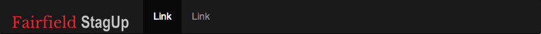

  The problem is [right here](http://getbootstrap.com/components/#navbar-brand-image), quoted from the Bootstrap website:
  > Since the `.navbar-brand` has its own padding and height, you may need to override some CSS depending on your image.

  Basically, the logo image is taller than the "Fairfield StagUp" text we just replaced. We're going to need to override some CSS to fix it, something we'll come back to later.

**3. Lay out the Featured Events panel.**  
We are now going to devote the rest of this session to the `.feature-panel` section.   

Here's the relevant section on our Draw.io mockup:
  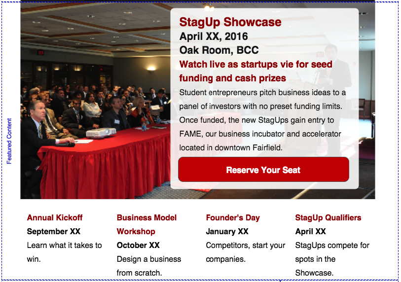

* Scroll down to the `.feature-panel` section. Remove any placeholder text you might see inside.
* Remove the `row` class from the `.feature-panel`.  
  >We're about to replace it with two rows.

* Insert two divs as shown:
```html
  <section class="feature-panel">
    <div class="featured-events-top row">

    </div>
    <div class="featured-events-bottom row">

    </div>
  </section>
```
  > The top div is for the highlighted event with the background image. The bottom div is for the other featured events.

* Just so we can see them in the preview, insert a bit of text into each div. We'll remove the text later on.
```html
  <section class="feature-panel">
    <div class="featured-events-top row">
      Top
    </div>
    <div class="featured-events-bottom row">
      Bottom
    </div>
  </section>
```

  

**4. Populate the `.featured-panel` content.**  
In our mockup `.featured-events-top` has a full-width background image (cyan text) and a semi-translucent white text box (green text). Below it, the `featured-events-bottom` has 4 equally-spaced areas for the other featured events (purple divider lines).  
  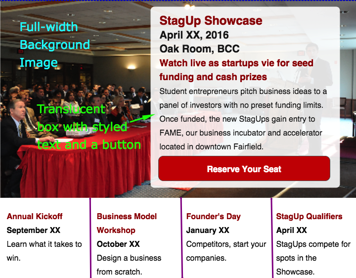

The background image will added with just CSS, but the others will require some HTML first.

* Inside the `.featured-events-top` replace the placeholder text with a new div for the white box as shown:
```html
  <div class="featured-events-top row">
    <div class="featured-text-container">
      <h1>Event Title</h1>
      <h2>Event Date</h2>
      <h2>Event Location</h2>
      <h3>Event Tagline</h3>
      <p>Lorem ipsum dolor sit amet, consectetur adipiscing elit.
      Maecenas erat ligula, vulputate sit amet tristique sed,
      cursus eget ante. Cras a neque in lorem vehicula vulputate.
      Nam justo velit, iaculis et mauris at, fringilla sagittis diam.
      Phasellus dignissim tempus lacus et iaculis.
      Integer eu nisi iaculis, pellentesque nunc ac, finibus nunc.</p>
      <a href="#">Reserve Your Seat</a>
    </div>
  </div>
```

  > Copy and paste works well here. You'll note that we used a link instad of a `button` for the button. That's because clicking on it will just redirect to another page (like a link) instead of submitting a form or triggering something to happen in Javascript. Using a link is more accurate in the HTML. We'll make it look like a button before we ae done.  

* Inside the `.featured-events-bottom` replace the placeholder text with 4 new divs:
```html
  <div class="featured-events-bottom row">
    <div class="featured-event-teaser">
      <h1>Event #1 Title</h1>
      <h2>Event #1 Date</h2>
      <h3>Event #1 Tagline</h3>
    </div>
    <div class="featured-event-teaser">
      <h1>Event #2 Title</h1>
      <h2>Event #2 Date</h2>
      <h3>Event #2 Tagline</h3>
    </div>
    <div class="featured-event-teaser">
      <h1>Event #3 Title</h1>
      <h2>Event #3 Date</h2>
      <h3>Event #3 Tagline</h3>
    </div>
    <div class="featured-event-teaser">
      <h1>Event #4 Title</h1>
      <h2>Event #4 Date</h2>
      <h3>Event #4 Tagline</h3>
    </div>
  </div>
```

* The page should now look like this:
  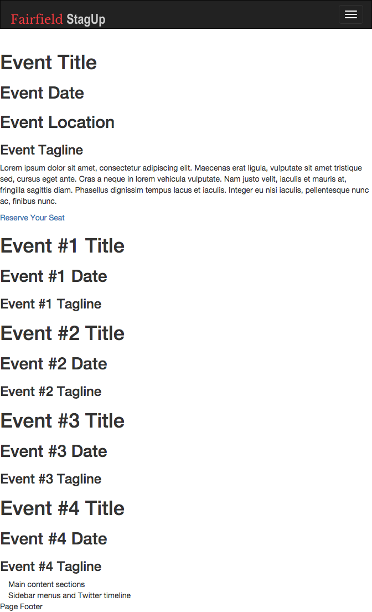

  > Not that impressive, but it'll get better in the next steps.

**5. Apply Bootstrap CSS classes.**
  * We'll start with the `.featured-text-container`, which is supposed to display on the right. It's as simple as adding few handy `.col-*-*` classes from Bootstrap's [Grid System](http://getbootstrap.com/css/#grid):

  ```html
    <div class="featured-events-top row">
      <div class="featured-text-container col-sm-8 col-sm-offset-4 col-md-6 col-md-offset-6">
      ...
      </div>
    </div>
  ```

    > Each of the classes shown has a purpose:  
    > * `.featured-text-container` allows us to select the element in our custom CSS.
    > * `.col-sm-8` and `col-md-6` indicate the width of the box (in grid columns) at various sizes. The width is 12 columns on mobile (the default), 8 columns on small tablets (`.col-sm-8`) and 6 columns on larer tablets and desktops (`col-md-6`).
    > * `.col-sm-offset-4` and `.col-md-offset-6` push the box to the right to fit the device width.  `.col-sm-offset-4` pushes it 4 columns on small tablets, while `.col-md-offset-6` pushes it 6 columns for larger tablets and desktops.

  At medium browser widths, the page looks like this:
  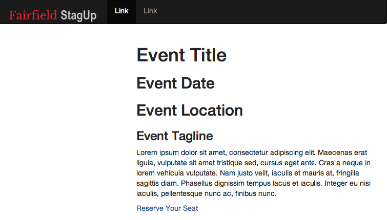

  > Not getting a good preview from Atom? Try opening the file in your web browser.
  You can get the URL by right-clicking on the filename in Atom and selecting 'Copy Full Path'.

* Next, let's use a [Bootstrap's Typographic class](http://getbootstrap.com/css/#type)
to provide a visual hierarchy to the text.  

  **Add the `lead` class to the lorem ipsum paragraph.**
  ```html
  <p class="lead">Lorem ipsum dolor sit amet, consectetur adipiscing elit.
  ...
  Integer eu nisi iaculis, pellentesque nunc ac, finibus nunc.</p>
  ```

  >The text will get bigger with a slightly thinner font weight:
  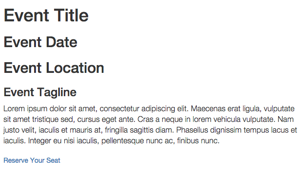

  > Bootstrap has classes for all sorts of common text formatting.
  You can align text left, right, and center.
  You can highlight, strike out, and downsize the text if you like.
  With Bootstrap 3 you can even use [Glyphicons](http://getbootstrap.com/components/#glyphicons)
  to decorate your text with fonts that look like pictures.

* Moving on, let's style the link to [look like a button](http://getbootstrap.com/css/#buttons).

    **Add the `btn` and `btn-primary` classes, like so:**  

    ```html
    <a href="#" class="btn btn-primary">Reserve Your Seat</a>
    ```

    > The `btn` class is common to all Bootstrap buttons. The `btn-primary` class marks the button as the primary action ("call to action") offered up to the user.

    > The link will turn into a blue button:
    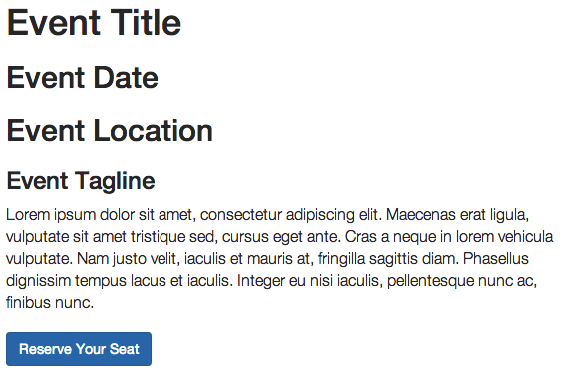

    ** Now add `btn-lg` and `btn-block` classes to make the button *really* stand out.**
    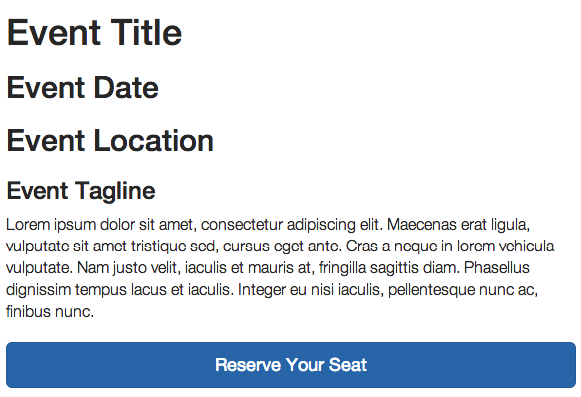

* Finally, for the `.featured-events-bottom` items, we just need to do a little grid-work.

  **Add `.col-md-3` and `.col-sm-6` to each of the `featured-event-teaser` divs.**  
```html  
  <div class="featured-event-teaser col-md-3 col-sm-6">
  ...
  </div>
  <div class="featured-event-teaser col-md-3 col-sm-6">
  ...
  </div>
  <div class="featured-event-teaser col-md-3 col-sm-6">
  ...
  </div>
  <div class="featured-event-teaser col-md-3 col-sm-6">
  ...
  </div>
```

  > Like magic, the event teasers will rearrange themselves to fit the page width.  
  > On desktop widths (`.col-md-3`) they will appear to be 4 across in a row.
    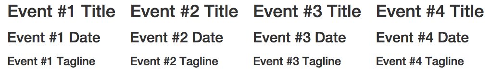

  >On small tablets (`.col-sm-6`) they will appear as two rows of 2 items.
    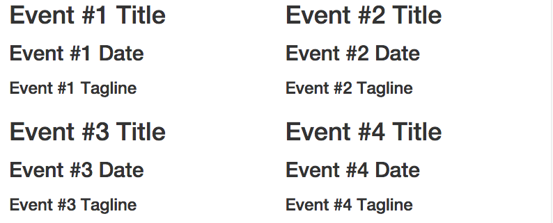

  >On phones (the default layout) they will appear in a single column, one after the other.
    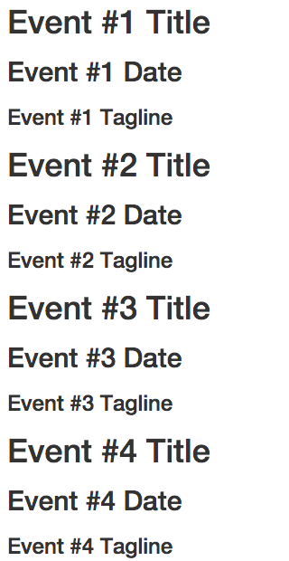

  >Load the page in your browswer and resize the window. It should just work.

**6. Add an external stylesheet.**  
We finally get to use the `styles.css` stylesheet we created in step 1. We'll use it to add the background image and to override some of the Bootstrap text styling.

* In the head of your `index.html` file, add a link to your `styles.css` file *just after* the link to Bootstrap's css file:
```html  
  <!-- Bootstrap -->
  <link rel="stylesheet" href="https://maxcdn.bootstrapcdn.com/bootstrap/3.3.5/css/bootstrap.min.css">

  <!-- Custom Styling -->
  <link rel="stylesheet" href="assets/css/styles.css">

  ```

  > Don't forget the comment for your new link.

* Open up the `styles.css` file for editing.
* At the top of the file add a *header comment* explaining that the file is about:
  ```css
  /**
  * ====================================================================
  *  styles.css -- Global styles for the Fairfield StagUp website
  * ====================================================================
  */
  ```

* Add comments below, which we'll use to group our CSS rules according to which part
of the page they are styling. We'll add more groups of rules in another session. *Don't leave out the blank lines. Neatness counts in web design.*
  ```css
  /**
  * ====================================================================
  *  styles.css -- Global styles for the Fairfield StagUp website
  * ====================================================================
  */

  /*---- Basic Styling ----*/

  /*---- Navbar Styling ----*/

  /*---- Feature-Panel Styling ----*/

  ```

  >CSS files often have hundreds or even thousands of lines of code, and can easily
  become a mess if there is not some basic order applied up front. Generally, it
  helps if the rules appear in at least approximately the same order as the elements
  they apply to appear in the HTML document. You also want the most generic, broadly
  applicable rules to appear before more narrowly-defined rules. Once we know more CSS
  we will discuss [BEM](https://css-tricks.com/bem-101), which provides a standard way of
  keeping order and avoiding redundancy in CSS files.

**6. Define the Basic Styling rules.**  
The Basic Styling section of our stylesheet is where we define things like fonts and
colors used throughout the document, whitespace above and below paragraphs, etc. We'll leave most of the
default Bootstrap styling alone for now, but we should do something about the black `h1` headlines and blue button.

* Add a rule to change the text color of all `h1` to `darkred`:
  ```css
  /*---- Basic Styling ----*/
  h1 {
    color:darkred;
  }
  ```

* Add a second rule to change the button from blue to red:
```css
/*---- Basic Styling ----*/
h1 {
    color:darkred;
}
.btn-primary {
    background-color: #C6102E; /* bright cherry red */
    border-color: #A50D27; /* a darker shade of the same red */
}
```

  **Save the file.**

  >Atom's preview panel won't likely update to show the color. It's probably best to
  keep the document open in a browser so you can refresh it after each save.

**7. Fix the Logo Placement in the Navbar**  
The problem with the logo is that Bootstrap assumes the `.navbar-brand` link is no more than 20px tall.
So, it inserts 15px padding (whitespace) above and below it to keep it approximately in line with the menu links. However, since our logo is 38px tall and the navbar is only 50px tall, there is not enough room for the padding.

  >Let's see how we can figure that out ourselves. **In your browser window, right-click on the Fairfield StagUp logo and select "Inspect element".**  
  This will show us the HTML and CSS for the selected `img` element.
    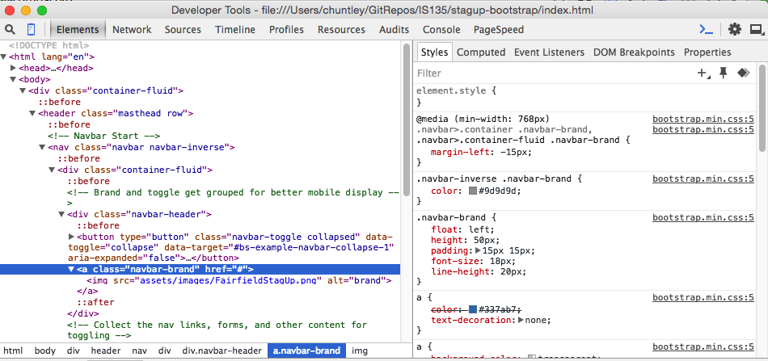

  >In the inspector panel/window, click on the `.navbar-brand` link as shown in the screenshot above. You should notice `padding` is 15px for the `.navbar-brand` class.

* Add the rule below, which sets the padding to 6px above and below and 15px left and right.
```css
/*---- Navbar Styling ----*/
.navbar-brand { padding: 6px 15px;}
```

  > Don't worry if this rule seems strange, with padding set to 6px and 15px at the same time. We'll learn about this sort of notation when we get to CSS Box Models.

  The navbar now looks aligned just right:  
  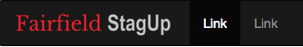

**8. Set the background and padding for `.featured-events-top`.**  
The background image is inside our assets folder. All we have to do is use it.

* Add a rule setting the `background-image` to the `FeaturePhoto.jpg` file.

  ```css
    /*---- Feature-Panel Styling ----*/
    .featured-events-top {
      background-image: url(../images/FeaturePhoto.jpg);
    }
  ```

  > Why does the URL start with "../"? Because CSS uses a relative path based on the location of the CSS file, not the HTML file. The "../" tells CSS to look one directory up to find the images folder.

  > While the background looks great, we're clearly not done yet:
  * The background image stays the same size regardless of the page width. We want it to stretch and shrink to fit.
  * The text does not show up nicely against the background image.
  We'll cover them one at a time.

* Add a `background-size` property to the `.featured-events-top` rule to fill (cover) the full width and a `background-position` property to center it vertically and horizontally:
  ```css
    /*---- Feature-Panel Styling ----*/
    .featured-events-top {
      background-image: url(../images/FeaturePhoto.jpg);
      background-size: cover;
      background-position: center center;
    }
  ```

  > Refresh and resize your browser. The background will stretch perfectly.

* Add a new rule to set the background color of the `.featured-text-container` to white.
  ```css
    /*---- Feature-Panel Styling ----*/
    .featured-events-top {
      background-image: url(../images/FeaturePhoto.jpg);
      background-size: cover;
      background-position: center center;
    }
    .featured-text-container {
      background-color: white;
    }
  ```

  > While that makes the text stand out, it also blocks out half the background image entirely. There are really two problems. First, the white background is solid, not translucent. Second, it seems a bit crowded without any space around it.
  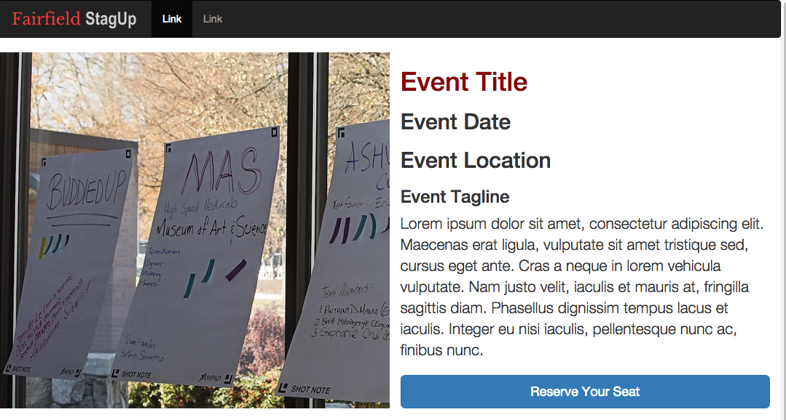

* Change the `.featured-text-container` background color to `rgba(100%, 100%, 100%, 0.8)`, which is the color code for an 80% opaque white.
    > We'll learn more about color models soon. Just use the code provided for now.

  ```css
    /*---- Feature-Panel Styling ----*/
    .featured-events-top {
      background-image: url(../images/FeaturePhoto.jpg);
      background-size: cover;
      background-position: center center;
    }
    .featured-text-container {
      background-color: rgba(100%, 100%, 100%, 0.8);
    }
  ```

  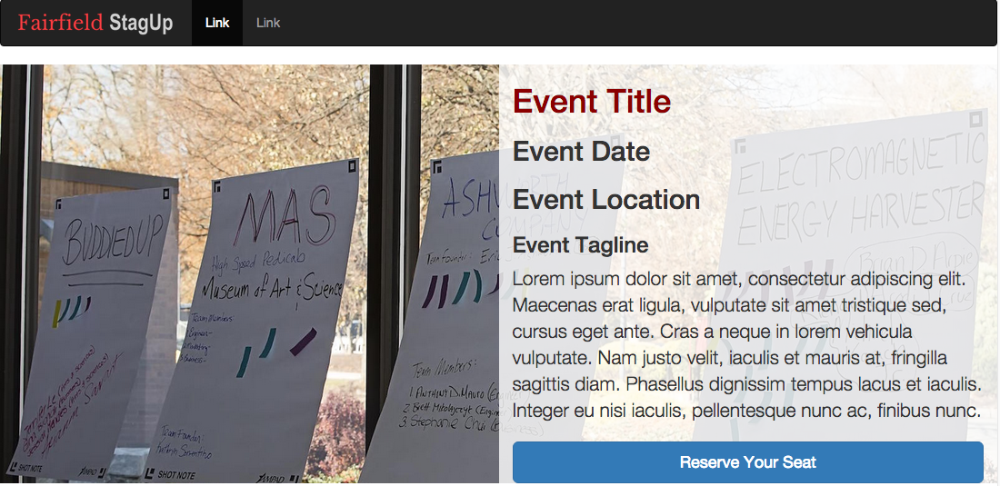

* Change the padding inside the ``.featured-events-top` to 15px to give the `.featured-text-container` some room.  

  ```css
    /*---- Feature-Panel Styling ----*/
    .featured-events-top {
      background-image: url(../images/FeaturePhoto.jpg);
      background-size: cover;
      background-position: center center;
      padding: 15px;
    }
    .featured-text-container {
      background-color: rgba(100%, 100%, 100%, 0.8);
    }
  ```

  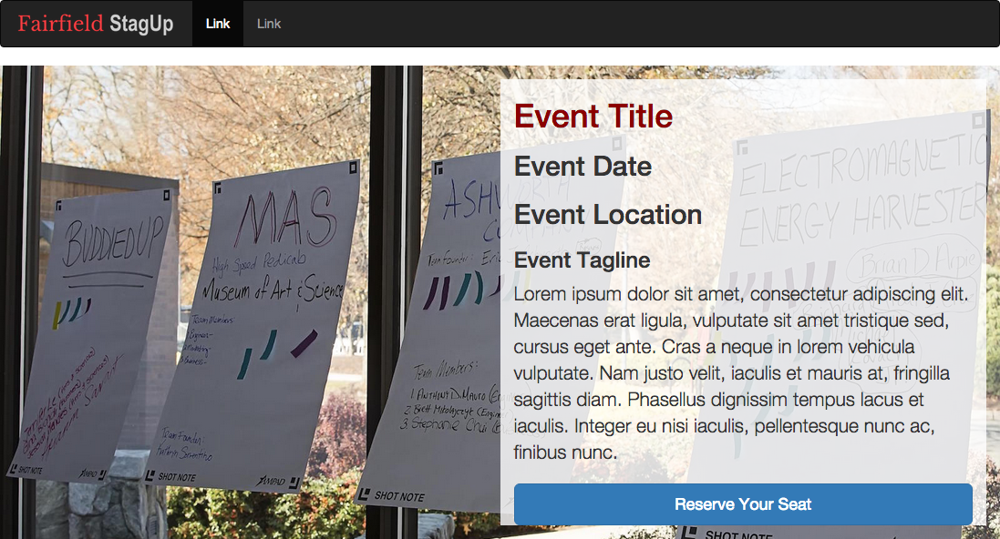

* Finally, add some padding to the `.featured-text-container` to give the button some room.
  ```css
    /*---- Feature-Panel Styling ----*/
    .featured-events-top {
      background-image: url(../images/FeaturePhoto.jpg);
      background-size: cover;
      background-position: center center;
      padding: 15px;
    }
    .featured-text-container {
      background-color: rgba(100%, 100%, 100%, 0.8);
      padding: 15px;
    }
  ```

  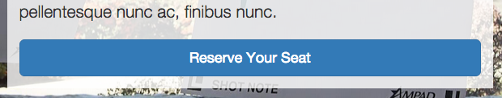

**9. Adjust the typography for the Feature Panel Styling.**  
While typography is very much an art form that resists hard rules, we can usually get along pretty
well with three basic principles:
* Text elements that are grouped closely together are somehow related.
* Larger text implies more importance than smaller text.
* Text elements that display the same kind of information should be styled similarly

We'll now apply these principles to the text elements in our featured events panel.

* Because Bootstrap adds lots of margin ("external" padding) to `h1`, `h2`, and `h3` elements, our event titles, dates, and locations seem disjointed. Reducing this whitespace will make the text look more connected. We can handle that with descendent selectors, like so:

  ```css
  /*---- Feature-Panel Styling ----*/
  .feature-panel h1, .feature-panel h2, .feature-panel h3 {
    margin:0 0 4px;
  }
  .featured-events-top {
    background-image: url(../images/FeaturePhoto.jpg);
    background-size: cover;
    background-position: center center;
    padding: 15px;
  }
  .featured-text-container {
    background-color: rgba(100%, 100%, 100%, 0.8);
    padding: 15px;
  }
  ```

  > The new rule belongs at the *top* of the group (just below the comment) because it is more general than the others. The `margin` setting uses a shorthand notation to specify that there be exactly 4 pixels of whitespace below each selected element. The rule uses a grouped selector (with commas) so that the same declarations apply equally to `h1`, `h2`, and `h3` without any redundancy.
  > You'll note that this is the second time we've mentioned redundancy. That's because redundant code tends to create bugs!

* With the whitespace removed from the titles, the event teasers in the bottom are now looking a bit crowded. Let's add back 15px of padding all around:

  ```css
  /*---- Feature-Panel Styling ----*/
  .feature-panel h1, .feature-panel h2, .feature-panel h3 {
    margin:0 0 4px;
  }
  .featured-events-top {
    background-image: url(../images/FeaturePhoto.jpg);
    background-size: cover;
    background-position: center center;
    padding: 15px;
  }
  .featured-text-container {
    background-color: rgba(100%, 100%, 100%, 0.8);
    padding: 15px;
  }
  .featured-events-bottom {
    padding: 15px;
  }
  ```

* The titles in the main featured event at the top should be larger than those below it. Rather than make it bigger, we'll just make the others smaller. Add the rules to the bottom of the group because they are the most specific and refer to elements lower down the page. Again, we'll use descendent selectors.

  ```css
  /*---- Feature-Panel Styling ----*/
  .feature-panel h1, .feature-panel h2, .feature-panel h3 {
    margin:0 0 4px;
  }
  .featured-events-top {
    background-image: url(../images/FeaturePhoto.jpg);
    background-size: cover;
    background-position: center center;
    padding: 15px;
  }
  .featured-text-container {
    background-color: rgba(100%, 100%, 100%, 0.8);
    padding: 15px;
  }
  .featured-events-bottom {
    padding: 15px;
  }
  .featured-events-bottom h1 {
    font-size: 30px;
  }
  .featured-events-bottom h2 {
    font-size: 24px;
  }
  .featured-events-bottom h3 {
    font-size:20px;
  }
  ```

* The titles for the main event also look slightly out of proportion. The event date and location seem to be a little big compared with the title. Let's shrink them down from 30px to 27px.

```css
/*---- Feature-Panel Styling ----*/
.feature-panel h1, .feature-panel h2, .feature-panel h3 {
  margin:0 0 4px;
}
.featured-events-top {
  background-image: url(../images/FeaturePhoto.jpg);
  background-size: cover;
  background-position: center center;
  padding: 15px;
}
.featured-text-container {
  background-color: rgba(100%, 100%, 100%, 0.8);
  padding: 15px;
}
.featured-events-top h2 {
  font-size: 27px;
}
.featured-events-bottom {
  padding: 15px;
}
.featured-events-bottom h1 {
  font-size: 30px;
}
.featured-events-bottom h2 {
  font-size: 24px;
}
.featured-events-bottom h3 {
  font-size:20px;
}
```

> Having trouble finding the new rule? It's in the middle, just above the ones for the bottom part of the panel.

* Lastly, let's make the taglines (the `h3` elements) stand out more by coloring them to match the titles. Because we want to apply the red to both top and bottom, we'll use a more general rule near the top.

```css
/*---- Feature-Panel Styling ----*/
.feature-panel h1, .feature-panel h2, .feature-panel h3 {
  margin:0 0 4px;
}
.feature-panel h3 {
  color: darkred;
}
.featured-events-top {
  background-image: url(../images/FeaturePhoto.jpg);
  background-size: cover;
  background-position: center center;
  padding: 15px;
}
.featured-text-container {
  background-color: rgba(100%, 100%, 100%, 0.8);
  padding: 15px;
}
.featured-events-top h2 {
  font-size: 27px;
}
.featured-events-bottom {
  padding: 15px;
}
.featured-events-bottom h1 {
  font-size: 30px;
}
.featured-events-bottom h2 {
  font-size: 24px;
}
.featured-events-bottom h3 {
  font-size:20px;
}
```

**10. Save your work.**
Commit to Git. Use the commit summary 'Completed part 4'. Push (sync) as usual to GitHub.
