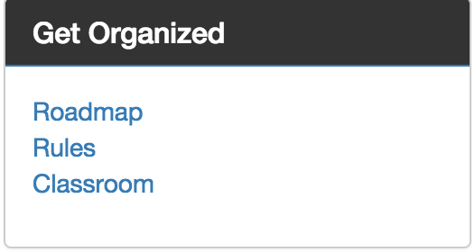
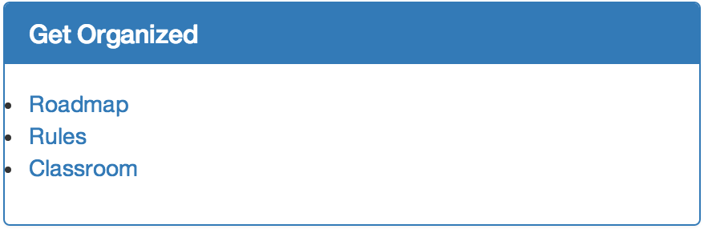

# StagUp Bootstrap, Part 5: Panels

## Objectives
* Create basic menu panels

**1. Populate the sidebar menus.**
The sidebar includes several menus, each styled as a [Bootstrap panel](http://getbootstrap.com/components/#panels).

* Inside the `.sidebar-content` area convert the current placeholder text to an HTML comment.
```html
<aside class="sidebar-content col-sm-3">
  <!-- Sidebar menus and Twitter timeline -->        
</aside>
```

* Just below the comment add a new `nav` element with `.panel-primary` styling.

  ```html
  <aside class="sidebar-content col-sm-3">
    <!-- Sidebar menus and Twitter timeline -->
    <nav class="panel panel-primary">

    </nav>  
  </aside>
```

  The `panel` class marks the nav as a Bootstrap panel. The `panel-primary` class marks it as a panel with a dark background and white lettering for the title.

  This panel is about to become our first menu. When we're done it will look like this:   
  

  The panel has two main parts: a charcoal gray heading with the title "Get Organized" and a panel body with a list of links. We're going to use the rules laid out in the Bootstrap panels documentation to craft the HTML. Then we'll apply some basic CSS to make it look like how we want it.

* Use a `div` to give the panel a `.panel-heading`.
```html
<aside class="sidebar-content col-sm-3">
  <!-- Sidebar menus and Twitter timeline -->
  <nav class="panel panel-primary">
    <div class="panel-heading">

    </div>
  </nav>
</aside>
```

* Inside the `.panel-heading` use an `h1` to give the panel a `.panel-title`.

```html
<aside class="sidebar-content col-sm-3">
  <!-- Sidebar menus and Twitter timeline -->
  <nav class="panel panel-primary">
    <div class="panel-heading">
      <h1 class="panel-title">Get Organized</h1>
    </div>
  </nav>
</aside>
```

* Below the `.panel-heading` add an unordered list of menu links.

```html
<aside class="sidebar-content col-sm-3">
  <!-- Sidebar menus and Twitter timeline -->
  <nav class="panel panel-primary">
    <div class="panel-heading">
      <h1 class="panel-title">Get Organized</h1>
    </div>
    <ul>
        <li><a href="#">Roadmap</a></li>
        <li><a href="#">Rules</a></li>
        <li><a href="#">Classroom</a></li>
    </ul>
  </nav>
</aside>
```

* Set the class of the list to `panel-body` so that Bootstrap can style it appropriately.

```html
<aside class="sidebar-content col-sm-3">
  <!-- Sidebar menus and Twitter timeline -->
  <nav class="panel panel-primary">
    <div class="panel-heading">
      <h1 class="panel-title">Get Organized</h1>
    </div>
    <ul class="panel-body">
        <li><a href="#">Roadmap</a></li>
        <li><a href="#">Rules</a></li>
        <li><a href="#">Classroom</a></li>
    </ul>
  </nav>
</aside>
```

* Repeat the panel HTML for a second panel, titled "Learn," that has three links: "Business Models", "Business Pitches", and "Business Plans."

**2. Style the Bootstrap panels.**
* Preview the page. The panels look sort of right, except for the colors and bullet points.
  

* Open the `styles.css` file for editing. At the bottom of the stylesheet add a new section comment for our new panel styling:

  ```css
  /*---- Panel/Menu Styling ----*/
  ```
* Now add a rule to set the border-color of the `.panel` to light gray (`#cccccc`):  
  ```css
  /*---- Panel/Menu Styling ----*/
  .panel-primary {
    border-color: #cccccc;
  }
  ```

* Use a descendant selector to set the background of the `.panel-heading` to charcoal gray (`#333333`):  
  ```css
  /*---- Panel/Menu Styling ----*/
  .panel-primary {
    border-color: #cccccc;
  }
  .panel-primary .panel-heading {
    background-color: #333333;
  }
  ```

* To remove the bullet points, use another descendant selector on the unordered list:
  ```css
  /*---- Panel/Menu Styling ----*/
  .panel-primary {
    border-color: #cccccc;
  }
  .panel-primary .panel-heading {
    background-color: #333333;
  }
  nav li {
    list-style:none outside;
  }
  ```

**3. Add the Twitter Timeline.**
* Add another sidebar panel just like the other two. This time, however, the panel doesn't contain a navigation menu, so we'll just use divs instead of navs and lists.

```html
<div class="panel panel-primary">
  <div class="panel-heading">
      <h1 class="panel-title">The Late</h1>
  </div>
  <div class="panel-body">
  </div>
</div>

* Inside the `.panel-body`, insert the following embedding code from Twitter:  
```html
<a class="twitter-timeline" data-tweet-limit="10"
data-widget-id="634723474951565312" href="https://twitter.com/StagUp_BPC">Tweets by @StagUp_BPC</a>
<script>!function(d,s,id){var js,fjs=d.getElementsByTagName(s)[0],p=/^http:/.test(d.location)?'http':'https';
if(!d.getElementById(id)){js=d.createElement(s);js.id=id;js.src=p+"://platform.twitter.com/widgets.js";
fjs.parentNode.insertBefore(js,fjs);}}(document,"script","twitter-wjs");</script>
```

* If you copied the embedding code correctly. the timeline shoould look something like this:
  

**4. Save your work.**  
Commit to Git. Use the commit summary 'Completed part 5'. Push (sync) as usual to GitHub.
