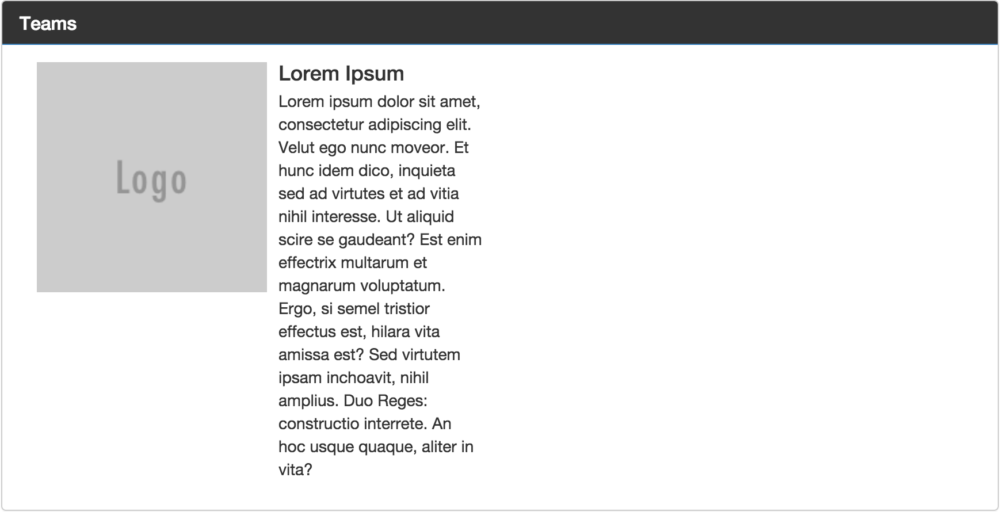
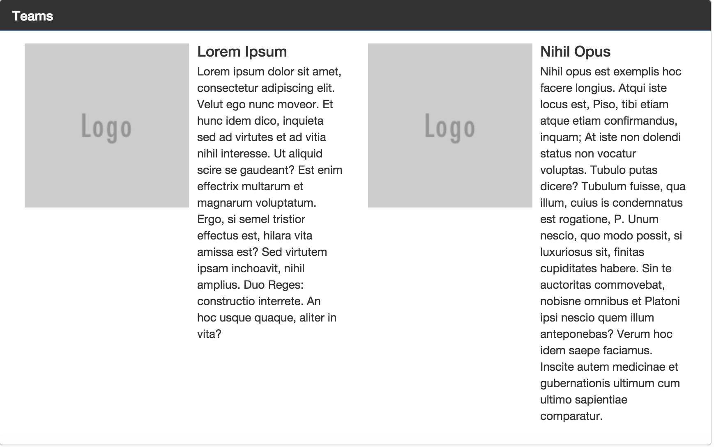
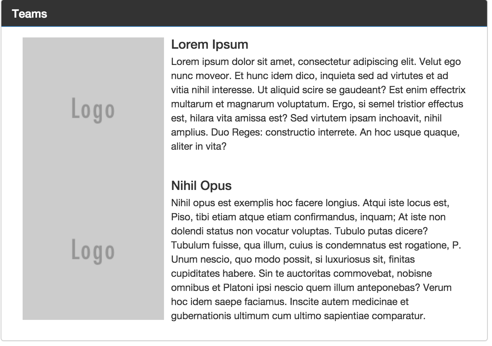
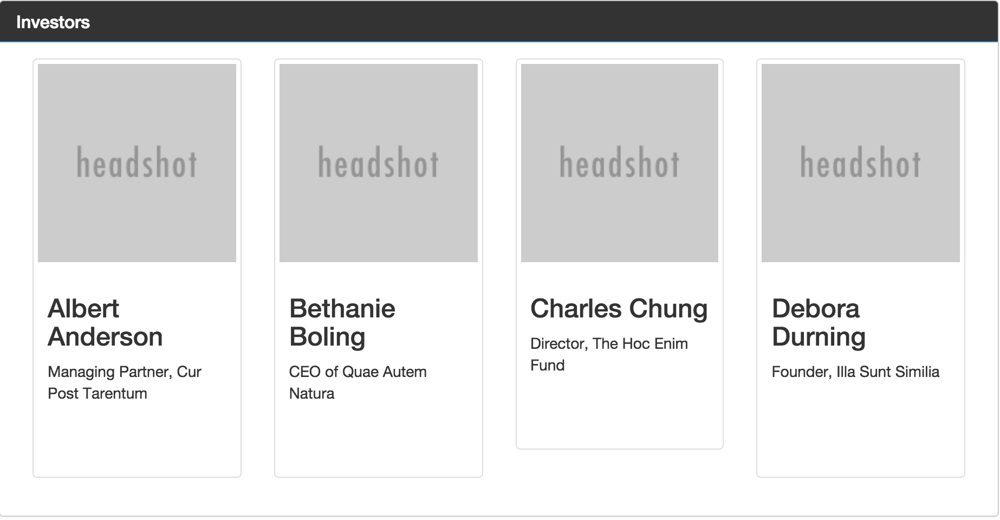
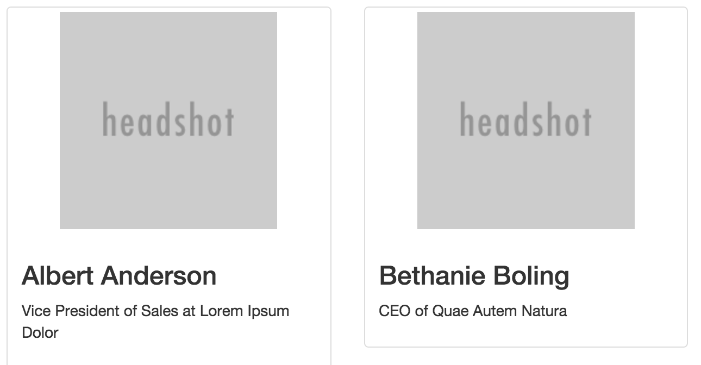
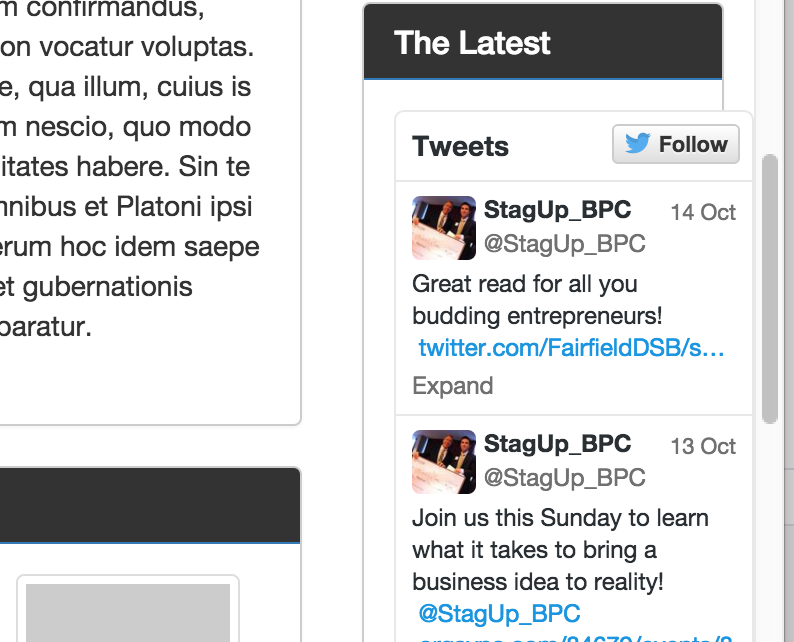
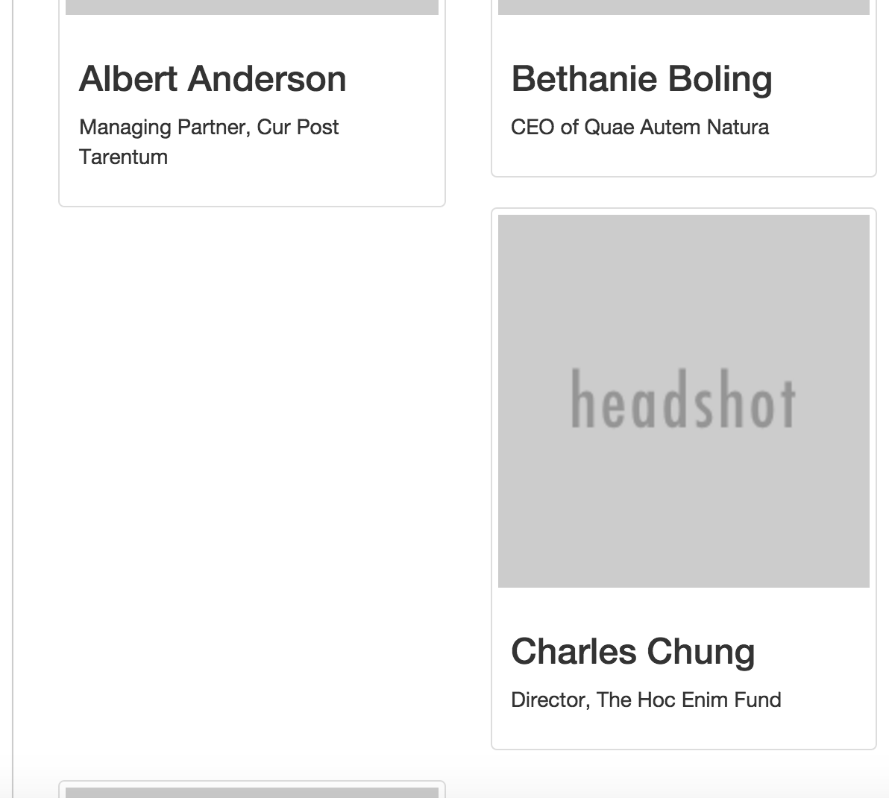

# StagUp Bootstrap, Part 6: Thumbnails and Media Objects

## Objectives
* Use the grid syststem to lay out content
* Use thumbnails and media objects to structure content items
* Use within-page links to connect menus to content

**1. Create and link the Teams and Investors panels.**  

* Open the `index.html` file for editing. We're going to add two panels to the `.main-content` section, just like we created the sidebar menus in part 5. Each `.panel` has a unique `id` and a `.panel-heading`, a `.panel-title`, and a `.panel-body`. The `.panel-body` is where we will insert the teams / investor profiles.
* Just inside the `.main-content` section, add a blank panel for the team profiles.

```html
  <main class="main-content col-sm-9">
    <div id="teams" class="panel panel-primary">
      <div class="panel-heading">
        <h1 class="panel-title">
          Teams
        </h1>
      </div>
      <div class="panel-body">

      </div>
    </div>
  </main>
```

* Repeat for the investor profiles.
```html
  <main class="main-content col-sm-9">
    <div id="teams" class="panel panel-primary">
      <div class="panel-heading">
        <h1 class="panel-title">
          Teams
        </h1>
      </div>
      <div class="panel-body">

      </div>
    </div>

    <div id="investors" class="panel panel-primary">
      <div class="panel-heading">
        <h1 class="panel-title">
          Investors
        </h1>
      </div>
      <div class="panel-body">

      </div>
    </div>

  </main>
```
* In the `.navbar-nav` at the top of the page, set the links to point to our new panels using id selectors.

  ```html
  <ul class="nav navbar-nav">
    <li class="active"><a href="#teams">Teams <span class="sr-only">(current)</span></a></li>
    <li><a href="#investors">Investors</a></li>
  </ul>
  ```

  > So, just like how we can refer to the `#teams` panel in CSS, we can do the same thing in URLs! Links that use the `#` in this way are sometimes called "bookmarks" or "anchor links".

**2. Populate and style the Team profiles.**

* Just inside the `.panel-body` of the `#teams` panel, add a new Bootrap row and grid element that takes up half the available width on midsized (and larger) devices.
  ```html
  <div class="panel-body">
    <div class="row">
      <div class="col-md-6">

      </div>
    </div>
  </div>
  ```

  > This is going to be the first of our team profiles. Each team profile will include a logo, a company name, and a blurb about the business concept. We'll use Bootstrap's [media objects](http://getbootstrap.com/components/#media) to make the logos behave side-by-side with the profile text.

* Wrap a pair of explanatory comments around our new div element:
  ```html
  <div class="panel-body">
    <div class="row">
      <!-- start first team -->
      <div class="col-md-6">

      </div>
      <!-- end first team -->
    </div>
  </div>
  ```

* Copy the [boilerplate media object from the Bootstrap website](http://getbootstrap.com/components/#media-default)  and paste it inside our new `div.col-md-6`:

  ```html
  <div class="panel-body">
    <div class="row">

      <!-- start first team -->
      <div class="col-md-6">
        <div class="media">
          <div class="media-left">
            <a href="#">
              
            </a>
          </div>
          <div class="media-body">
            <h4 class="media-heading">Media heading</h4>
            ...
          </div>
        </div>
      </div>
      <!-- end first team -->

    </div>
  </div>
  ```

* Add the class "team-profile" to the `div.media` so that we can select it later in our CSS.  
  ```html
  <div class="panel-body">
    <div class="row">

      <!-- start first team -->
      <div class="col-md-6">
        <div class="team-profile media">
          ...
        </div>
      </div>
      <!-- end first team -->

    </div>
  </div>
  ```

* Set the `src` of the `img.media-object` to `https://placeholdit.imgix.net/~text?txtsize=38&txt=Logo&w=150&h=150`, which generates a gray 150x150 placeholder image. Change the `alt` to "company logo".
* Inside the `h4.media-heading`, change the "Media heading" text to "Lorem Ipsum Dolor".
* Replace the elipses under the `h4` with the [first paragraph of the traditional 'Lorem Ipsum' text](http://loripsum.net/api/4/medium).
* The result is this:

  ```html
  <div class="panel-body">
    <!-- start first team -->
    <div class="col-md-6">
      <div class="team-profile media">
        <div class="media-left">
          <a href="#">
            
          </a>
        </div>
        <div class="media-body">
          <h4 class="media-heading">Lorem Ipsum Dolor</h4>
          <p>Lorem ipsum dolor sit amet, consectetur adipiscing elit. Velut ego nunc moveor. Et hunc idem dico, inquieta sed ad virtutes et ad vitia nihil interesse. Ut aliquid scire se gaudeant? Est enim effectrix multarum et magnarum voluptatum. Ergo, si semel tristior effectus est, hilara vita amissa est? Sed virtutem ipsam inchoavit, nihil amplius. Duo Reges: constructio interrete. An hoc usque quaque, aliter in vita? </p>
        </div>
      </div>
    </div>
    <!-- end first team -->
  </div>
  ```

  

* Within the same `.row`, repeat the same pattern for a second media object, this time for a company called "Nihil Opus". The company blurb is the second paragraph of the Lorem Ipsum text.

  ```html
  <div class="panel-body">
    <div class="row">

      <!-- start first team -->
      <div class="col-md-6">
        <div class="media">
          <div class="media-left">
            <a href="#">
              
            </a>
          </div>
          <div class="media-body">
            <h4 class="media-heading">Lorem Ipsum Dolor</h4>
            <p>Lorem ipsum dolor sit amet, consectetur adipiscing elit. Velut ego nunc moveor. Et hunc idem dico, inquieta sed ad virtutes et ad vitia nihil interesse. Ut aliquid scire se gaudeant? Est enim effectrix multarum et magnarum voluptatum. Ergo, si semel tristior effectus est, hilara vita amissa est? Sed virtutem ipsam inchoavit, nihil amplius. Duo Reges: constructio interrete. An hoc usque quaque, aliter in vita? </p>
          </div>
        </div>
      </div>
      <!-- end first team -->

      <!-- start second team -->
      <div class="col-md-6">
        <div class="team-profile media">
          <div class="media-left">
            <a href="#">
              
            </a>
          </div>
          <div class="media-body">
            <h4 class="media-heading">Nihil Opus</h4>
            <p>Nihil opus est exemplis hoc facere longius. Atqui iste locus est, Piso, tibi etiam atque etiam confirmandus, inquam; At iste non dolendi status non vocatur voluptas. Tubulo putas dicere? Tubulum fuisse, qua illum, cuius is condemnatus est rogatione, P. Unum nescio, quo modo possit, si luxuriosus sit, finitas cupiditates habere. Sin te auctoritas commovebat, nobisne omnibus et Platoni ipsi nescio quem illum anteponebas? Verum hoc idem saepe faciamus. Inscite autem medicinae et gubernationis ultimum cum ultimo sapientiae comparatur. </p>
          </div>    
        </div>
      </div>
      <!-- end second team -->

    </div>
  </div>
  ```

  At desktop widths the two profiles should be side-by-side, each taking up half the width of the panel.

  

  At mobile widths, however, they are stacked one on top of the other.

  

  > Notice a problem? The two media objects are crowding each other. We'll need to fix that by adding some vertical spacing. The most logical place is along the bottom of each media object within a panel.

* At the bottom of `styles.css` add a rule to that sets the bottom margin of `.media` elements within `.panel` elements to `1em`.

  ```css
  .panel .media {
    margin-bottom: 1em;
  }
  ```

  The elements now stack nicely at mobile widths.

**3. Populate and style the Investor profiles.**  
* Scroll down to the `#investors` panel.
* Inside the  `.panel-body` create a div with grid classes `col-xs-6` and `col-sm-3`. (This will make the width change depending on the panel width.) Also, wrap it in comments like the ones we used for the team profiles.

  ```html
  <div class="panel-body">

    <!-- start investor profile -->
    <div class="col-xs-6 col-sm-3">

    </div>
    <!-- end investor profile -->

  </div>
  ```

  > Like with the team profiles, we're going to use a special Bootstrap component that works well with grids. This time it's a [Bootstrap thumbnail](http://getbootstrap.com/components/#thumbnails) instead of a media object. The effect is similar, but a thumbnail is a little more flexible than a media object. For example, thumbnails have (mostly) responsive images that shrink to fit the space provided without any extra CSS.  

* Inside the new div, paste the [Custom Content Thumbnail boilerplate  html](http://getbootstrap.com/components/#thumbnails-custom-content), like so:
  ```html
  <div class="panel-body">

    <!-- start investor profile -->
    <div class="col-xs-6 col-sm-3">
      <div class="thumbnail">
      
      <div class="caption">
        <h3>Thumbnail label</h3>
        <p>...</p>
        <p><a href="#" class="btn btn-primary" role="button">Button</a> <a href="#" class="btn btn-default" role="button">Button</a></p>
      </div>
    </div>
    <!-- end investor profile -->

  </div>
  ```
* Add the class `investor-profile` to the `.thumbnail` div.
* Set the `src` of the img to 'https://placeholdit.imgix.net/~text?txtsize=38&txt=Headshot&w=200&h=200'. The `alt` should also be set to something sensible.
* Change the `h3` text to "Albert Anderson".
* Inside the empty `p` replace the elipsis with "Managing Partner, Cur Post Tarentum".
* Remove the `p` with the buttons entirely.
* The HTML should be like this:
  ```html
  <!-- start investor profile -->
  <div class="col-xs-6 col-sm-3">
    <div class="investor-profile thumbnail">
      
      <div class="caption">
        <h3>Albert Anderson</h3>
        <p>Managing Partner, Cur Post Tarentum</p>
      </div>
    </div>
  </div>
  <!-- end investor profile -->

  ```

* Repeat the pattern for thumbnails for "Bethanie Boling" / "CEO of Quae Autem Natura", "Charles Chung" / "Director, The Hoc Enim Fund", and "Debora Durning" / "Founder, Illa Sunt Similia".

* Refresh your browswer. At a suitably wide width, the panel should look like this:
  

  > There are problems, however, at small widths. We'll deal with them separately.

**4. Resolve responsive grid and sizing problems.**  

Inspect the page at various browswer widths. You'll find some a few problems.

* When the investor profile thumbnails get wide, the headshots don't grow to fit, leaving thick margins on either side.
  

  Solution: Make the thumbnail image fully responsive, filling 100% of the available space.

  ```css
  .thumbnail img {
    width:100%;
  }
  ```

* When the page is just wide enough for the sidebar to appear on the right, the Twitter timeline overflows its panel, spilling out onto the right margin. This can cause all sorts of problems on an iPad.

  

  Solution: Only show the Twitter timeline on desktops. We can do that using [Bootstrap's Responsive Utility](http://getbootstrap.com/css/#responsive-utilities) classes. In this case we want to apply `.visible-lg` to the panel, like so:

  ```html
  <div class="panel panel-primary visible-lg">
    <div class="panel-heading">
      <h1 class="panel-title">
        The Latest
      </h1>
    </div>
    <div class="panel-body">
      ...
    </div>
  </div>
  ```

* At apparently random intermediate widths, the investor profile grid seems to get weird gaps.
  

  Solution: The cause is the varying heights of the thumbnails. This is actually [a common problem](http://stackoverflow.com/questions/24590222/bootstrap-3-grid-with-different-height-in-each-item-is-it-solvable-using-only). The easiest solution is to make all of the thumbnail paragraphs the same minimum height.

  ```css
  #investors .thumbnail p {
    min-height: 6em;
  }
  ```

  > `6em` is approximately the same height as 6 lines of text.

**5. Save your work.**  
