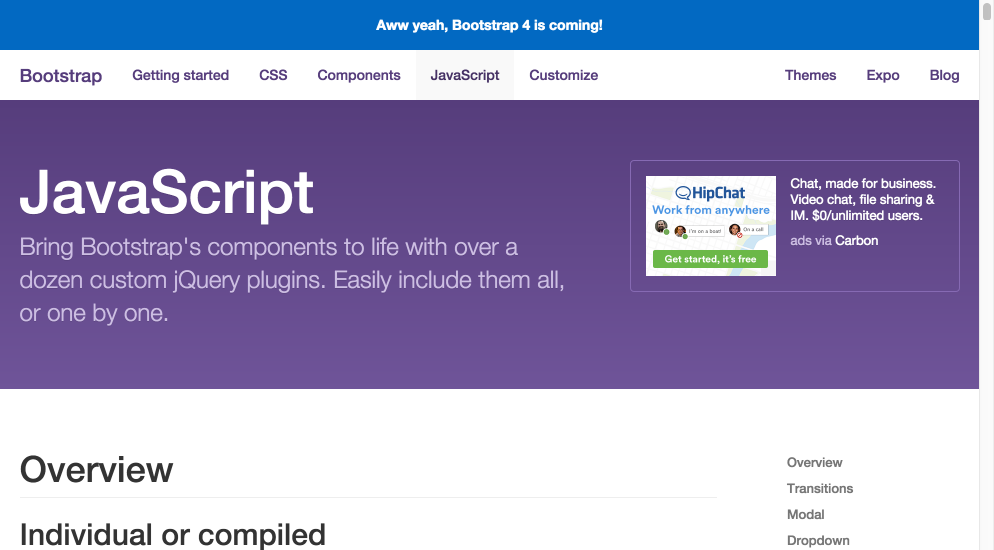

# StagUp Bootstrap Preliminaries

## Objectives
* Study the Bootstrap documentation
* Browse through some examples

**1. Open the [Bootstrap docs](http://getbootstrap.com) and take a look around.**  
  

  The framework is designed to provide reusable code and tools for building websites. The framework is developed and maintained by the front-end engineers at Twitter has become very popular with web designers for its simplicity and huge feature set. Bootstrap 3 is the current production release, with version 4 (currently in alpha) expected sometime in late 2015 or 2016. We will be using version 3 though we might take a peek at version 4 once it’s closer to a production release.

  The documentation are organized into several pages, each of which covers a different kind of *feature*:
  * **Getting Started**  
    A collection of themes, boilerplate HTML pages, and tools that make getting started really easy.
  * **CSS**  
    A very large set of CSS classes that can used to add style to just about any HTML. So, for example, if you want to make an HTML link look like a button then just add `class=”btn btn-default”` to the link:
    ```html
    <a href=”#” class=”btn btn-default”>some link text</a>
    ```
    Probably the most useful of all the CSS classes are used in the grid system, which allows us to organize content into rectangular regions that fit together nicely and even grow/shrink to fit the page width.
  * **Components**  
    A collection of reusable user interface elements (i.e., “components) that can make assembling even very complex pages fairly painless. Each component combines specially-structured HTML with accompanying CSS classes that control what everything looks like. For example, there is a special nav component that can be used to create menus of items and then style them to look like buttons, tabs, etc. There is even a jumbotron component for creating an Apple-style huge product image for the top of your website.
  * **Javascript**
    A collection of components that also require javascript to do something. This is where you would find image carousels, dropdowns, accordions, and other fanciness that add specialized behavior to your pages.
  * **Customize**   
    Not exact a feature of the *framework*, this is more like a feature of the Bootstrap *website*. You can download highly customized copies of Bootstrap that eliminate features you don’t need. Using a lean, barebones copy of Bootstrap can make your pages load faster.

Take some time to play with the features. There is really is a lot to work with and *you don't need to design any of it yourself*. After all, why reinvent the wheel unles you really intend to build a better wheel.

**2. Explore the Expo.**  
Browse through some of the finished [websites in the  Bootstrap Expo](http://expo.getbootstrap.com). You’ll find Spotify, Newsweek, and lots of other big media sites, but there are also a lot of sites for smaller companies, nonprofits, and even a few universities. None of them look bad, some even look very good! Underneath they are all Bootstrap just the same. And Bootstrap is 100% free.     
